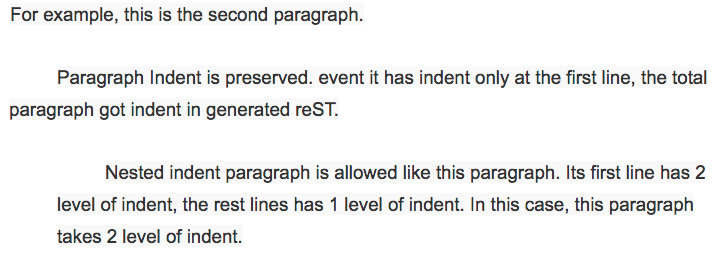

Document Structure and Components
#################################

Document Structure
******************

+----------------+-------------------+------+
|Hierarchy       |Google Docs Heading|Markup|
+----------------+-------------------+------+
|Parts           |Title              |#     |
+----------------+-------------------+------+
|Chapter         |Heading 1          |\*    |
+----------------+-------------------+------+
|Section         |Heading 2          |=     |
+----------------+-------------------+------+
|Subsection      |Heading 3          |\-    |
+----------------+-------------------+------+
|Subsubsection   |Heading 4          |~     |
+----------------+-------------------+------+
|Subsubsubsection|Heading 5          |^     |
+----------------+-------------------+------+
|Paragraph       |Normal Text        |      |
+----------------+-------------------+------+

Paragraph
*********

Any chunk of text with “Normal text” style will be converted to reST paragraph.  No line break will be inserted for a single paragraph. There will be an empty line between different paragraph.

For example, this is the second paragraph.

   Paragraph Indent is preserved. event it has indent only at the first line, the total paragraph got indent in generated reST.

      Nested indent paragraph is allowed like this paragraph. Its first line has 2 level of indent, the rest lines has 1 level of indent. In this case, this paragraph takes 2 level of indent.

Table
*****

List
****

Numbered List
*************

Image

Inline Image

Inline Markup
