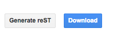

GGeditor
########

GGeditor is a  `Google Docs Add-on <https://support.google.com/a/answer/4530135?hl=en>`_  for editing reST file. That is, you edit the content in Google Docs and with GGeditor to convert it into  `reST format <http://docutils.sourceforge.net/docs/ref/rst/restructuredtext.html>`_ . 

The converted reST file can be downloaded or committed to Github. Once it was in the Github, it will be integrated with the sphinx service by `Read The Docs <https://readthedocs.org/>`_ .

Features:
*********

#. Easy start for reST beginners.

#. Almost what you see is what you get.

#. Preview generated reST files and download it.

#. Just copy and paste images, the reST Editor will handle them.

#. Convert Google docs table into reST table.

#. Convert inline links into reST link markup.

#. Convert list items into reST list.

#. Binding the Google doc with the Github file, then commit it directly to the Github.

+---------+-----------------------------------------------------+
|Like this|                                                     |
+---------+-----------------------------------------------------+
|         |a like to  `google <http://www.google.com>`_  <- link|
+---------+-----------------------------------------------------+

Known Issues:
*************

* When repository was renamed:

   * If the repository or folder name of the binding file in Github was renamed, a re-binding is required for committing.

* Open hyperlink in a new tab:

   * This is not supported.  `Please see details here <https://github.com/sphinx-doc/sphinx/issues/1634>`_ .

* Only text is allowed in a list item. Text with hyperlink is fine.

   * But image, table in a list item is not supported. If it does, it will be interpreted as outside the list.

* Image subfolder naming limitation.

   * If there is an image in a Google Docs document which is binding to README.rst, when committing to the Github, that image will be put into a subfolder named “README”. 

   * Which means if there is a file named “README” in the same folder of README.rst, confliction would happen.

* When the binding file has changed

   * If the binding file has changed, according to the new binding name, a new  image subfolder might be created. Which means the original image subfolder should be removed manually.
