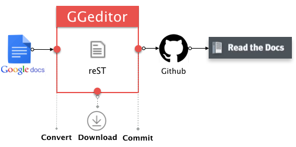

.. _h28105e656d4d48041184d771d3b4a1a:

GGeditor
********

\ **GGeditor**\  is a Google Docs Add-on for generating \ `reStructuredText`_\  file from the Google Docs. The generated reST file can be committed to the Github repository with the GGeditor. Then, that repository’s documentations hosted by the \ `Read The Docs`_\  got automatically updated.

\ |IMG1|\ 

.. _h6897050511836763421463e2b4b685:

Features
========

#. Easy starting for reST beginners, even no idea about reST markups.
#. Powered by the Google Docs. Almost what you see is what you get.
#. One-click to commit to the Github repository.
#. Preview the generated reST file and download to local machine.
#. Support headings, bold, italic, hyperlink, subscript and superscript.
#. Support footnotes, image, list item and table.
#. Support full-width characters (CKJ) in headings and table.
#. Support internal links to bookmarks, headings and Google Docs native table of contents (in document table of contents).
#. Support relative links to other generated reST files of the Google Docs under the same folder and subfolders.
#. Support cross-document table of content (.. doctree::) for the readthedocs.org.
#. Support all style of admonitions of the readthedocs.org.

.. _h18206c5a232448777c266b647f1b7765:

More Information
================

Please refer to \ `the GGeditor documentation site`_\ .

.. _`reStructuredText`: https://en.wikipedia.org/wiki/ReStructuredText
.. _`Read The Docs`: https://readthedocs.org/
.. _`the GGeditor documentation site`: http://ggeditor.readthedocs.io/en/latest/index.html

