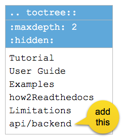

.. _h61d62117b185b142af77803e484226:

How to Create API Docs
**********************

.. _h4c525118060635e4b6959584f2f3435:

Create API document for a python module
=======================================

.. _h547a1e3306f3d91f375c20216815:

Scenario
--------

We have a python module "backend". And suppose that scripts in the backend follows the \ |LINK1|\ .

.. _h7a2e78741a2351e456f44714e35538:

1.  Modify the conf.py
~~~~~~~~~~~~~~~~~~~~~~

in the "docs/conf.py"\ [#F1]_\ , 

#. append a line to insert the backend to sys.path (Line #4)

#. ensure the autodoc and napoleon are in the extensions (Line #7)

#. add a subroutine named run_apidoc (Line #9-17)

#. add a callback to builder-inited by app.connect (Line #23)

.. code-block:: python
    :linenos:

    import sys, os
    
    # append the next line to conf.py, should change "backend" to your module name
    sys.path.insert(0, os.path.join(os.path.dirname(__file__),'..','backend'))
    
    # ensure the autodoc and napoleon are in the extensions
    extensions = ['sphinx.ext.autodoc', 'sphinx.ext.napoleon']
    
    def run_apidoc(_):
        from sphinx.apidoc import main
        parentFolder = os.path.join(os.path.dirname(__file__), '..')
        cur_dir = os.path.abspath(os.path.dirname(__file__))
        sys.path.append(parentFolder)
        # change "backend" to your module name
        module = os.path.join(parentFolder,'backend')
        output_path = os.path.join(cur_dir, 'api')
        main(['-e','-f','-o', output_path, module])
    
    def setup(app):
        # overrides for wide tables in RTD theme
        app.add_stylesheet('theme_overrides.css')
        # trigger the run_apidoc
        app.connect('builder-inited', run_apidoc)
    

.. _h1a1a795c227a5a253f613e8433d361:

2. Modify the index.rst
~~~~~~~~~~~~~~~~~~~~~~~

This step is optional. Suppose we hope the generated api document can be accessed from the menu on the left side, we have to modify the toctree table in the index.rst. Like this:

\ |IMG1|\ 

.. _h732845536db30978122116f26674:

3. Done
~~~~~~~

Commit the conf.py and the index.rst, then that's done. You can see the api document at the readthedocs.org (RTD)  by this URL:

http://<project-name>.readthedocs.io/en/latest/api/<module-name>.html, in this demo case, this is 

http://ggeditor.readthedocs.io/en/latest/api/backend.html

.. _h7673574b773f1b7a512a1d6957245829:

Create API document for a python script
=======================================

.. _h547a1e3306f3d91f375c20216815:

Scenario
--------

We have a python script "backend/apidocsample.py". And suppose that this script follows the \ |LINK2|\ .

.. _h4a147a424a522934355c4c74751f2a2:

Process
-------

.. _h7a2e78741a2351e456f44714e35538:

1.  Modify the conf.py
~~~~~~~~~~~~~~~~~~~~~~

in the "docs/conf.py", 

#. append a line to insert the backend to sys.path (Line #4)

#. ensure the autodoc and napoleon are in the extensions (Line #7)

.. code-block:: python
    :linenos:

    import sys, os
    
    # append the next line to conf.py
    sys.path.insert(0, os.path.join(os.path.dirname(__file__),'..','backend'))
    
    # ensure the autodoc and napoleon are in the extensions
    extensions = ['sphinx.ext.autodoc', 'sphinx.ext.napoleon']

.. _hb4a132b7e60292339252f1532303836:

2. Create the apidocsample.rst
~~~~~~~~~~~~~~~~~~~~~~~~~~~~~~

Create the apidocsample.rst in the "docs"

.. code:: 

    apidocsample module
    ====================
    
    .. automodule:: apidocsample
        :members:
        :undoc-members:
        :show-inheritance:

.. _h732845536db30978122116f26674:

3. Done
~~~~~~~

Commit the conf.py and the apidocsample.rst, then that's done. You can see the api document at the RTD by this URL:

http://<project-name>.readthedocs.io/en/latest/<rst-filename>.html, in this demo case, it is http://ggeditor.readthedocs.io/en/latest/apidocsample.html

..  Hint:: 

    The key ideas are:
    
    #. The python script (apidocsample.py) should be able to import by the sphinx builder, so sys.path should be updated in the conf.py.
    
    #. apidocsample.rst in the docs folder is a placeholder-like file which triggers the sphinx builder to lookup apidocsample.py and collects markups from it.

.. bottom of content

.. |LINK1| raw:: html

    <a href="http://google.github.io/styleguide/pyguide.html" target="_blank">Google Python Style Guide</a>

.. |LINK2| raw:: html

    <a href="http://google.github.io/styleguide/pyguide.html" target="_blank">Google Python Style Guide</a>

.. rubric:: Footnotes

.. [#f1]  More on http://www.sphinx-doc.org/en/1.4.8/config.html#build-config

