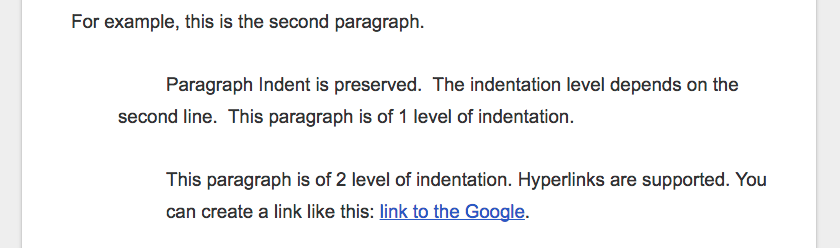

Document Structure and Components
#################################

Document Structure
******************

+----------------+-------------------+------+
|Hierarchy       |Google Docs Heading|Markup|
+----------------+-------------------+------+
|Parts           |Title              |#     |
+----------------+-------------------+------+
|Chapter         |Heading 1          |\*    |
+----------------+-------------------+------+
|Section         |Heading 2          |=     |
+----------------+-------------------+------+
|Subsection      |Heading 3          |\-    |
+----------------+-------------------+------+
|Subsubsection   |Heading 4          |~     |
+----------------+-------------------+------+
|Subsubsubsection|Heading 5          |^     |
+----------------+-------------------+------+
|Paragraph       |Normal Text        |      |
+----------------+-------------------+------+

Paragraph
*********

Any chunk of text with “Normal text” style is converted to reST paragraph.  No line break was inserted for a single paragraph. There is an empty line between every paragraph.

For example, this is the second paragraph.

   Paragraph Indent is preserved. event it has indent only at the first line, the total paragraph got indent in generated reST.

      Nested indent paragraph is allowed like this paragraph. Its first line has 2 level of indent, the rest lines has 1 level of indent. In this case, this paragraph takes 2 level of indent.

In Google Docs, it actually is like this:

Horizontal Rule
***************

Just insert a horizontal line in Google Docs, it will be converted to reST. Like this:

--------

Table
*****

List
****

Numbered List
*************

Image
*****

* Image with hyperlinks is exported to reST :target:.

* Image alt\-title was exported to reST :alt:, but alt\-description was not.

* Resized image dimension was coded as :width: and :height: argument of reST. Though, you will see this image with original size in Github’s preview page, but it is recognized in the Sphinx.

* Image adjustments, border, cropping was dropped. So always the original image was exported.

* Images were saved into a subfolder. The naming rules for this subfolder are:

   * For document with Github binding, the binding name was used.

   * For document without Github binding, the document name was used.

   * If there is file extension (ex, .rst) in the name, that extension was omitted.

   * If there is no file extension in the name, “_files” was appended to avoid naming\-conflict.

Inline Image
************

Inline Markup
*************
