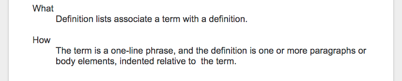

Document Structure and Components
#################################

Document Structure
******************

+----------------+-------------------+------+
|Hierarchy       |Google Docs Heading|Markup|
+================+===================+======+
|Parts           |Title              |#     |
+----------------+-------------------+------+
|Chapter         |Heading 1          |\*    |
+----------------+-------------------+------+
|Section         |Heading 2          |=     |
+----------------+-------------------+------+
|Subsection      |Heading 3          |\-    |
+----------------+-------------------+------+
|Subsubsection   |Heading 4          |~     |
+----------------+-------------------+------+
|Subsubsubsection|Heading 5          |^     |
+----------------+-------------------+------+
|Paragraph       |Normal Text        |      |
+----------------+-------------------+------+

Paragraph
*********

Any chunk of text with “Normal text” style is converted to reST paragraph.  No line break was inserted for a single paragraph. There is an empty line between every paragraph.

For example, in the Google Docs:

.. image:: DocStructure/img_1.png
   :height: 285 px
   :width: 697 px

It results:

For example, this is the second paragraph.

   Paragraph Indent is preserved. event it has indent only at the first line, the total paragraph got indent in generated reST.

      Nested indent paragraph is allowed like this paragraph. Its first line has 2 level of indent, the rest lines has 1 level of indent. In this case, this paragraph takes 2 level of indent.

Bullet List, Enumerated List
****************************

* Just use them as in Google Docs
* Nested list is fine

   * But the list style was depended on rendering.

* Image 
* Table in list item was not exported

Definition lists:
*****************

Just use the indentation for definition content like this:

It results:

What 

      Definition lists associate a term with a definition.
      

How

      The term is a one\-line phrase, and the definition is one or more paragraphs or body elements, indented relative to  the term.

--------

Horizontal Line
***************

Just insert a horizontal line in Google Docs, it was converted to reST. Like this:

--------

Table
*****

A Google Docs table was exported to a reST table with the following rules:

* Text and hyperlink of text was exported.
* Heading rows with all cell text to be bold were exported as header rows.
* Nested table, image were not exported.
* Text alignment, indent in cells were not exported. 
* Line break was preserved. Which means, you got to break a very long sentence manually in order not to have a very long cell.

For example, in the Google Docs:

.. image:: DocStructure/img_3.png
   :height: 317 px
   :width: 697 px

It results:

+----------------------------------------------+---------------------------------------+---------------------+
|Make all cells BOLD                           | would upgrade this row                | to be a header row  |
+==============================================+=======================================+=====================+
|Normal cell text                              |                                       |Empty cell in my left|
+----------------------------------------------+---------------------------------------+---------------------+
|Hyper link is fine                            |#. This is #1                          |                     |
|                                              |#. This is #2                          |                     |
|| Link to  `google <http://www.google.com>`_  |                                       |                     |
|| Link to  `Facebook <http://facebook.com>`_  |   * This is #a                        |                     |
|| Link to  `Apple <http://apple.com>`_        |   * This is #b                        |                     |
|                                              |                                       |                     |
|                                              |      #. This is #1                    |                     |
|                                              |      #. This is #2                    |                     |
|                                              |      #. This is #3                    |                     |
|                                              |                                       |                     |
|                                              |   * This is #c                        |                     |
|                                              |                                       |                     |
|                                              |#. This is #3                          |                     |
+----------------------------------------------+---------------------------------------+---------------------+
|But  image                                    | , column or row span does not exported|                     |
|                                              |                                       |                     |
+----------------------------------------------+---------------------------------------+---------------------+

--------

Image
*****

* Please set image to be “Inline” in Google Docs, like this:

.. image:: DocStructure/img_4.png
   :height: 60 px
   :width: 206 px
   :align: center

* Image with hyperlinks is exported to :target:.
* Horizontal alignment (left, center and right) is exported to :align:
* Image alt\-title was exported to reST :alt:, but alt\-description was not.
* Resized dimension was exported to  :width: and :height:. 
* Image adjustments, border, cropping in Google Docs were dropped when exported to reST. Always the original image was exported.
* Please be noted, currently the Github skipped :width:, :height:, :align:. you will see them be effective in the Sphinx (ReadTheDocs) only.
* Images were saved into a subfolder. The naming rules for this subfolder are:

   #. For document with Github binding, the binding name was used.
   #. For document without Github binding, the document name was used.
   #. If there is file extension (ex, .rst) in the name, that extension was omitted.
   #. If there is no file extension in the name, “_files” was appended to avoid naming\-conflict.

Inline Image
************

Inline Markup
*************
