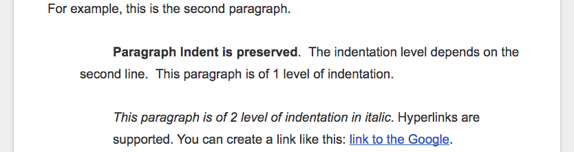
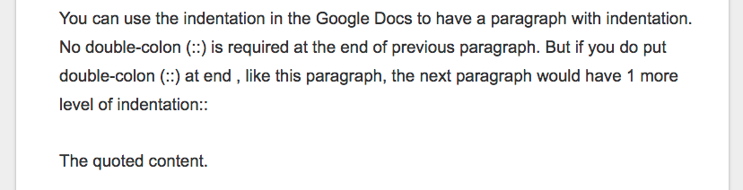
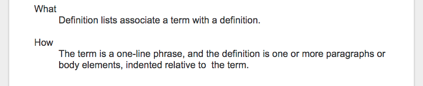
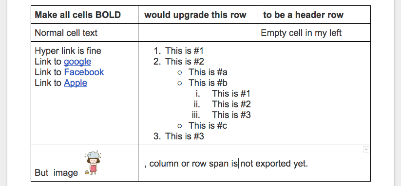

.. _h4e5c2e76333b146f4e4a6c4e5311365f:

Converting Rules
****************

Version 1.0

Date: Nov 16, 2016

Table of Supported Features

+----------------+------------+------------+-------------+-------------+
|Features        |In Paragraph|In List Item|In Table Cell|In Admonition|
+================+============+============+=============+=============+
|Normal Text     |Yes         |Yes         |Yes          |Yes          |
+----------------+------------+------------+-------------+-------------+
|Text alignment  |No          |No          |No           |No           |
+----------------+------------+------------+-------------+-------------+
|Background Color|No          |No          |No           |No           |
+----------------+------------+------------+-------------+-------------+
|Indentation     |Yes         |N/A         |             |No           |
+----------------+------------+------------+-------------+-------------+
|Headings        |Yes         |N/A         |N/A          |N/A          |
+----------------+------------+------------+-------------+-------------+
|Bold            |Yes         |Yes         |Yes          |No           |
+----------------+------------+------------+-------------+-------------+
|Italic          |Yes         |Yes         |Yes          |No           |
+----------------+------------+------------+-------------+-------------+
|Subscript       |Yes         |Yes         |Yes          |No           |
+----------------+------------+------------+-------------+-------------+
|Superscript     |Yes         |Yes         |Yes          |No           |
+----------------+------------+------------+-------------+-------------+
|Hyperlink       |Yes         |Yes         |Yes          |Yes          |
+----------------+------------+------------+-------------+-------------+
|Horizontal Line |Yes         |N/A         |N/A          |N/A          |
+----------------+------------+------------+-------------+-------------+
|Link to bookmark|Yes         |Yes         |Yes          |Yes          |
+----------------+------------+------------+-------------+-------------+
|Link to headings|Yes         |Yes         |Yes          |Yes          |
+----------------+------------+------------+-------------+-------------+
|Footnote        |Yes         |Yes         |Yes          |Yes          |
+----------------+------------+------------+-------------+-------------+
|Inline markup   |Yes         |Yes         |Yes          |Yes          |
+----------------+------------+------------+-------------+-------------+
|Image           |Yes         |Yes         |Yes          |Yes          |
+----------------+------------+------------+-------------+-------------+
|Image with link |Yes         |Yes         |Yes          |Yes          |
+----------------+------------+------------+-------------+-------------+
|Chart           |Yes         |            |             |             |
+----------------+------------+------------+-------------+-------------+
|Admonition      |Yes         |No          |No           |No (Nested)  |
+----------------+------------+------------+-------------+-------------+
|List item       |Yes         |Yes(Nested) |Yes          |Yes          |
+----------------+------------+------------+-------------+-------------+
|Table           |Yes         |No          |No (Nested)  |No           |
+----------------+------------+------------+-------------+-------------+
|Column span     |N/A         |N/A         |No           |N/A          |
+----------------+------------+------------+-------------+-------------+
|Rowspan         |N/A         |N/A         |No           |N/A          |
+----------------+------------+------------+-------------+-------------+
|Table of Content|Yes         |No          |No           |No           |
+----------------+------------+------------+-------------+-------------+

.. _h64a67723216a45226c6e5434607343:

Document Structure and Components
*********************************

+----------------+-------------------+------+
|Hierarchy       |Google Docs Heading|Markup|
+================+===================+======+
|Parts           |Title              |#     |
+----------------+-------------------+------+
|Chapter         |Heading 1          |\*    |
+----------------+-------------------+------+
|Section         |Heading 2          |=     |
+----------------+-------------------+------+
|Subsection      |Heading 3          |-     |
+----------------+-------------------+------+
|Subsubsection   |Heading 4          |~     |
+----------------+-------------------+------+
|Subsubsubsection|Heading 5          |^     |
+----------------+-------------------+------+
|Paragraph       |Normal Text        |      |
+----------------+-------------------+------+

.. _h2e201561772e25787b564d7c6271a:

Remarks on document structure
-----------------------------

* If you have unicode in heading text, such as CKJ characters, the markup in next line might be longer because it got length from bytes not words count.

--------

.. _h251a32c3d67762dd2f79492e157c:

Paragraph
=========

Any chunk of text with “Normal text” style is converted to reST paragraph.  

For example, in the Google Docs:

\ |IMG1|\ 

It results:

For example, this is the second paragraph.

        \ |STYLE0|\ .  The indentation level depends on the second line.  This paragraph is of 1 level of indentation. 

        \ |STYLE1|\ \ [#F1]_\         . Hyperlinks are supported. You can create a link like this: \ |LINK1|\ . 

.. _h494d3b7d2d2d66434623e305f3b9d:

Remarks on paragraph
--------------------

* You don’t need to put a backslash for escaping special characters.
* A link text is not to be bold and italic at the same time, and a bold text is not to be italic too.

.. _h6f5669738347e734b2391c49617a4c:

Literal Block, Quoted Block
===========================

You can use the indentation in the Google Docs to have a paragraph with indentation. No double-colon (::) is required at the end of previous paragraph. But if you do put  double-colon (::) at end , like this paragraph, the next paragraph would have 1 more level of indentation::

The quoted content.

The above paragraph in the Google Docs.

\ |IMG2|\ 

--------

.. _h53282618624d66441b3356396b775f3f:

Subscription, Superscription
============================

Not supported yet.

.. _h365552f4b3d1e5c62c7383180a9:

Bullet List, Enumerated List
============================

* Just use them as in Google Docs
* Nested list is fine

    * But the list style was depended on rendering.

* Image \ |IMG3|\ in list item was not exported
* Table in list item was not exported

The above list in the Google Docs:

\ |IMG4|\ 

--------

.. _h517d2944691c466b51131b41556f7f:

Definition lists:
=================

Just use the indentation for definition content like this:

\ |IMG5|\ 

It results:

What 

        Definition lists associate a term with a definition.

How

        The term is a one-line phrase, and the definition is one or more paragraphs or body elements, indented relative to  the term.

--------

.. _h4f5f18773d527364050184c733e3b71:

Horizontal Line
===============

Just insert a horizontal line in Google Docs, it was converted to reST. Like this:

--------

.. _h513c5b795d5d185d1c203d7e75205f41:

Table
=====

A Google Docs table was exported to a reST table with the following rules:

* Text and hyperlink of text was exported.
* Heading rows with all cell text to be bold were exported as header rows.
* Nested table, image were not exported.
* Text alignment, indent in cells were not exported. 
* Currently, column and row span is not supported.
* Line break was preserved. Which means, you got to break a very long sentence manually (with Shift+Enter) in order not to have a table with great width.

For example, in the Google Docs:

\ |IMG6|\ 

It results:

+---------------------+------------------------------------------+---------------------+
|Make all cells BOLD  | would upgrade this row                   | to be a header row  |
+=====================+==========================================+=====================+
|Normal cell text     |                                          |Empty cell in my left|
+---------------------+------------------------------------------+---------------------+
|Hyper link is fine   |#. This is #1                             |                     |
|                     |#. This is #2                             |                     |
|Link to \ |LINK2|\   |                                          |                     |
|Link to \ |LINK3|\   |    * This is #a                          |                     |
|Link to \ |LINK4|\   |    * This is #b                          |                     |
|                     |                                          |                     |
|                     |        #. This is #1                     |                     |
|                     |        #. This is #2                     |                     |
|                     |        #. This is #3                     |                     |
|                     |                                          |                     |
|                     |    * This is #c                          |                     |
|                     |                                          |                     |
|                     |#. This is #3                             |                     |
+---------------------+------------------------------------------+---------------------+
|But  image \ |IMG7|\ | , column or row span is not exported yet.|                     |
+---------------------+------------------------------------------+---------------------+

--------

.. _h425360541a6d36a14487962c584b8:

Image
=====

Image in the Google Docs was exported to reST. Chart  is image too, so it can be exported to reST.

* Please set image to be “Inline” in Google Docs, like this:

\ |IMG8|\ 

* Image with hyperlinks is exported to :target:.
* Horizontal alignment (left, center and right) is exported to :align:
* Image alt-title was exported to reST :alt:, but alt-description was not.
* Resized dimension was exported to  :width: and :height:. 
* Image adjustments, border, cropping in Google Docs were dropped when exported to reST. Always the original image was exported.
* Please be noted, currently the Github skipped :width:, :height:, :align:. you will see them be effective in the Sphinx (ReadTheDocs) only.
* The inline drawing in the Google Docs has not API to get its binary data, it is not able to be exported. Please use inline image instead of inline drawing.
* Images were saved into a subfolder. The naming rules for this subfolder are:

    #. For document with Github binding, the binding name was used.
    #. For document without Github binding, the document name was used.
    #. If there is file extension (ex, .rst) in the name, that extension was omitted.
    #. If there is no file extension in the name, “_files” was appended to avoid naming-conflict.

.. class:: 

        content of class

.. py:: function:: send_message(sender, [priority=1])

        Send a message to a recipient
    

        :param str sender: The person sending the message

        :param priority: The priority of the message, can be a number 1-5

        :type priority: integer or None

        :return: the message id

        :rtype: int

        :raises ValueError: if the message_body exceeds 160 characters

.. _h2c1d74277104e41780968148427e:

``Thihs is a code``

.. _h1851781a7781866c373d74142e52a:

Image subfolder naming scheme
=============================

* If there is an image in a Google Docs document which is binding to README.rst, when committing to the Github, that image will be put into a subfolder named “README”. 
* Which means if there is a file named “README” in the same folder of README.rst, confliction would happen.
* Some special characters in name, such as space, \*, / are replaced with _

.. |STYLE0| replace:: **Paragraph Indent is preserved**

.. |STYLE1| replace:: *This paragraph is of 2 level of indentation in italic*

.. |LINK1| raw:: html

    <a href="http://www.google.com" target="_blank">link to the Google</a>

.. |LINK2| raw:: html

    <a href="http://www.google.com" target="_blank">google</a>

.. |LINK3| raw:: html

    <a href="http://facebook.com" target="_blank">Facebook</a>

.. |LINK4| raw:: html

    <a href="http://apple.com" target="_blank">Apple</a>

.. rubric:: Footnotes

.. [#f1]  This is a footnote

.. |IMG4| image:: static/DocStructure_4.png
   :height: 202 px
   :width: 697 px

.. |IMG8| image:: static/DocStructure_7.png
   :height: 60 px
   :width: 206 px
