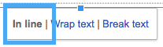

Document Structure and Components
#################################

Version 1.0

Date: Oct 25, 2016

Document Structure
******************

+----------------+-------------------+------+
|Hierarchy       |Google Docs Heading|Markup|
+================+===================+======+
|Parts           |Title              |#     |
+----------------+-------------------+------+
|Chapter         |Heading 1          |\*    |
+----------------+-------------------+------+
|Section         |Heading 2          |=     |
+----------------+-------------------+------+
|Subsection      |Heading 3          |\-    |
+----------------+-------------------+------+
|Subsubsection   |Heading 4          |~     |
+----------------+-------------------+------+
|Subsubsubsection|Heading 5          |^     |
+----------------+-------------------+------+
|Paragraph       ||icon|_            |      |
+----------------+-------------------+------+

Remarks on document structure
=============================

* If you have unicode in heading text, such as CKJ characters, the markup in next line might be longer because it got length from bytes not words count.

--------

Paragraph
*********

Any chunk of text with “Normal text” style is converted to reST paragraph.  

For example, in the Google Docs:

.. image:: DocStructure/img_1.png
   :height: 185 px
   :width: 697 px

.. |icon| image:: DocStructure/img_1.png

It results:

For example, this is the second paragraph.

    **Paragraph Indent is preserved** .  The indentation level depends on the second line.  This paragraph is of 1 level of indentation. 

       *This paragraph is of 2 level of indentation in italic* [#f1]_
      . Hyperlinks are supported. You can create a link like this:  `link to the Google <http://www.google.com>`_ . 

Remarks on paragraph
====================

* You don’t need to put a backslash for escaping special characters.
* A link text is not to be bold and italic at the same time, and a bold text is not to be italic too.

Literal Block, Quoted Block
***************************

You can use the indentation in the Google Docs to have a paragraph with indentation. No double\-colon (::) is required at the end of previous paragraph. But if you do put  double\-colon (::) at end , like this paragraph, the next paragraph would have 1 more level of indentation::

   The quoted content.

The above paragraph in the Google Docs.

.. image:: DocStructure/img_2.png
   :height: 178 px
   :width: 697 px

Subscription, Superscription
****************************

Not supported yet.

Bullet List, Enumerated List
****************************

* Just use them as in Google Docs
* Nested list is fine

   * But the list style was depended on rendering.

* Image in list item was not exported
* Table in list item was not exported

The above list in the Google Docs:

Definition lists:
*****************

Just use the indentation for definition content like this:

.. image:: DocStructure/img_3.png
   :height: 142 px
   :width: 697 px

It results:

What 

      Definition lists associate a term with a definition.
      

How

      The term is a one\-line phrase, and the definition is one or more paragraphs or body elements, indented relative to  the term.

--------

Horizontal Line
***************

Just insert a horizontal line in Google Docs, it was converted to reST. Like this:

--------

Table
*****

A Google Docs table was exported to a reST table with the following rules:

* Text and hyperlink of text was exported.
* Heading rows with all cell text to be bold were exported as header rows.
* Nested table, image were not exported.
* Text alignment, indent in cells were not exported. 
* Currently, column and row span is not supported.
* Line break was preserved. Which means, you got to break a very long sentence manually (with Shift+Enter) in order not to have a table with great width.

For example, in the Google Docs:

.. image:: DocStructure/img_4.png
   :height: 325 px
   :width: 697 px

It results:

+----------------------------------------------+------------------------------------------+---------------------+
|Make all cells BOLD                           | would upgrade this row                   | to be a header row  |
+==============================================+==========================================+=====================+
|Normal cell text                              |                                          |Empty cell in my left|
+----------------------------------------------+------------------------------------------+---------------------+
|Hyper link is fine                            |#. This is #1                             |                     |
|                                              |#. This is #2                             |                     |
|| Link to  `google <http://www.google.com>`_  |                                          |                     |
|| Link to  `Facebook <http://facebook.com>`_  |   * This is #a                           |                     |
|| Link to  `Apple <http://apple.com>`_        |   * This is #b                           |                     |
|                                              |                                          |                     |
|                                              |      #. This is #1                       |                     |
|                                              |      #. This is #2                       |                     |
|                                              |      #. This is #3                       |                     |
|                                              |                                          |                     |
|                                              |   * This is #c                           |                     |
|                                              |                                          |                     |
|                                              |#. This is #3                             |                     |
+----------------------------------------------+------------------------------------------+---------------------+
|But  image                                    | , column or row span is not exported yet.|                     |
|                                              |                                          |                     |
+----------------------------------------------+------------------------------------------+---------------------+

--------

Image
*****

Image in the Google Docs was exported to reST. Chart  is image too, so it can be exported to reST.

* Please set image to be “Inline” in Google Docs, like this:

* Image with hyperlinks is exported to :target:.
* Horizontal alignment (left, center and right) is exported to :align:
* Image alt\-title was exported to reST :alt:, but alt\-description was not.
* Resized dimension was exported to  :width: and :height:. 
* Image adjustments, border, cropping in Google Docs were dropped when exported to reST. Always the original image was exported.
* Please be noted, currently the Github skipped :width:, :height:, :align:. you will see them be effective in the Sphinx (ReadTheDocs) only.
* The inline drawing in the Google Docs has not API to get its binary data, it is not able to be exported. Please use inline image instead of inline drawing.
* Images were saved into a subfolder. The naming rules for this subfolder are:

   #. For document with Github binding, the binding name was used.
   #. For document without Github binding, the document name was used.
   #. If there is file extension (ex, .rst) in the name, that extension was omitted.
   #. If there is no file extension in the name, “_files” was appended to avoid naming\-conflict.

+-------------------+
|.. class::         |
+-------------------+
|   content of class|
+-------------------+

+---------------------------------------------------------------------+
|.. py:function:: send_message(sender, [priority=1])                  |
+---------------------------------------------------------------------+
|   Send a message to a recipient                                     |
+---------------------------------------------------------------------+
|   :param str sender: The person sending the message                 |
+---------------------------------------------------------------------+
|   :param priority: The priority of the message, can be a number 1\-5|
+---------------------------------------------------------------------+
|   :type priority: integer or None                                   |
+---------------------------------------------------------------------+
|   :return: the message id                                           |
+---------------------------------------------------------------------+
|   :rtype: int                                                       |
+---------------------------------------------------------------------+
|   :raises ValueError: if the message_body exceeds 160 characters    |
+---------------------------------------------------------------------+

\`\`Thihs is a code\`\`

.. rubric:: Footnotes
.. [#f1]  This is a footnote
