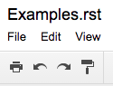

Examples
########

Paragraphs
**********

The next paragraph contains links, bold, italic, subscript and superscript text, clickable inline image . As well as a paragraph of the same content with indentation.

\ *In mathematics*\ , \ |IMG1|\  a \ **polynomial**\ \ [#f1]_\  is an \ `expression`_\  consisting of \ `variables`_\  (or \ `indeterminates`_\ ) and \ `coefficients`_\ , that involves only the operations of \ `addition`_\ , \ `subtraction`_\ , \ `multiplication`_\ , and non\-negative \ `integer`_\  \ `exponents`_\ . An example of a polynomial of a single indeterminate x is x\ :sup:`2`\  − 4x + 7. An example in three variables is x\ :sup:`3`\  + 2xyz\ :sup:`2`\  − yz + T\ :sub:`ab`\ . 

      \ *In mathematics*\ , \ |IMG2|\        a \ **polynomial**\  is an \ `expression`_\  consisting of \ `variables`_\  (or \ `indeterminates`_\ ) and \ `coefficients`_\ , that involves only the operations of \ `addition`_\ , \ `subtraction`_\ , \ `multiplication`_\ , and non\-negative\ [#f2]_\        \ `integer`_\  \ `exponents`_\ . An example of a polynomial of a single indeterminate x is x\ :sup:`2`\  − 4x + 7. An example in three variables is x\ :sup:`3`\  + 2xyz\ :sup:`2`\  − yz +  T\ :sub:`ab`\ .

List Item
*********

* \ *In mathematics*\ , \ |IMG3|\  a \ **polynomial**\ \ [#F3]_\  is an \ `expression`_\  consisting of \ `variables`_\  (or \ `indeterminates`_\ ) and \ `coefficients`_\ , that involves only the operations of \ `addition`_\ , \ `subtraction`_\ , \ `multiplication`_\ , and non\-negative \ `integer`_\  \ `exponents`_\ . An example of a polynomial of a single indeterminate x is x\ :sup:`2`\  − 4x + 7. An example in three variables is x\ :sup:`3`\  + 2xyz\ :sup:`2`\  − yz + T\ :sub:`ab`\ . 
* \ *In mathematics*\ , \ |IMG4|\  a \ **polynomial**\ \ [#F4]_\  is an \ `expression`_\  consisting of \ `variables`_\  (or \ `indeterminates`_\ ) and \ `coefficients`_\ , that involves only the operations of \ `addition`_\ , \ `subtraction`_\ , \ `multiplication`_\ , and non\-negative \ `integer`_\  \ `exponents`_\ . An example of a polynomial of a single indeterminate x is x\ :sup:`2`\  − 4x + 7. An example in three variables is x\ :sup:`3`\  + 2xyz\ :sup:`2`\  − yz + T\ :sub:`ab`\ . 

Table
*****

+-------------------------------------------------------------------------------------------------------------------------------------------------------------------------------------------------------------------------------------------------------------------------------------------------------------------------------------------------------------------------------------------------------------------------------------------------------------------------+----------------------------------------------------------------------------------------------------------------------------------------------------------------------------------------------------------------------------------------------------------------------------------------------------------------------------------------------------------------------------------------------------------------------------------------------------------------------------+
|\ *In mathematics*\ , \ |IMG5|\  a \ **polynomial**\ \ [#F5]_\  is an \ `expression`_\  consisting of \ `variables`_\  (or \ `indeterminates`_\ ) and \ `coefficients`_\ , that involves only the operations of \ `addition`_\ , \ `subtraction`_\ , \ `multiplication`_\ , and non\-negative \ `integer`_\  \ `exponents`_\ . An example of a polynomial of a single indeterminate x is x\ :sup:`2`\  − 4x + 7. An example in three variables is x\ :sup:`3`\  + 2xyz\ :sup:`2`\  − yz + T\ :sub:`ab`\ . |#. \ *In mathematics*\ , \ |IMG6|\  a \ **polynomial**\ \ [#F6]_\  is an \ `expression`_\  consisting of \ `variables`_\  (or \ `indeterminates`_\ ) and \ `coefficients`_\ , that involves only the operations of \ `addition`_\ , \ `subtraction`_\ , \ `multiplication`_\ , and non\-negative \ `integer`_\  \ `exponents`_\ . An example of a polynomial of a single indeterminate x is x\ :sup:`2`\  − 4x + 7. An example in three variables is x\ :sup:`3`\  + 2xyz\ :sup:`2`\  − yz + T\ :sub:`ab`\ . |
|                                                                                                                                                                                                                                                                                                                                                                                                                                                                         |#. \ *In mathematics*\ , \ |IMG7|\  a \ **polynomial**\ \ [#F7]_\  is an \ `expression`_\  consisting of \ `variables`_\  (or \ `indeterminates`_\ ) and \ `coefficients`_\ , that involves only the operations of \ `addition`_\ , \ `subtraction`_\ , \ `multiplication`_\ , and non\-negative \ `integer`_\  \ `exponents`_\ . An example of a polynomial of a single indeterminate x is x\ :sup:`2`\  − 4x + 7. An example in three variables is x\ :sup:`3`\  + 2xyz\ :sup:`2`\  − yz + T\ :sub:`ab`\ . |
+-------------------------------------------------------------------------------------------------------------------------------------------------------------------------------------------------------------------------------------------------------------------------------------------------------------------------------------------------------------------------------------------------------------------------------------------------------------------------+----------------------------------------------------------------------------------------------------------------------------------------------------------------------------------------------------------------------------------------------------------------------------------------------------------------------------------------------------------------------------------------------------------------------------------------------------------------------------+
|\ *In mathematics*\ , \ |IMG8|\  a \ **polynomial**\ \ [#F8]_\  is an \ `expression`_\  consisting of \ `variables`_\  (or \ `indeterminates`_\ ) and \ `coefficients`_\ , that involves only the operations of \ `addition`_\ , \ `subtraction`_\ , \ `multiplication`_\ , and non\-negative \ `integer`_\  \ `exponents`_\ . An example of a polynomial of a single indeterminate x is x\ :sup:`2`\  − 4x + 7. An example in three variables is x\ :sup:`3`\  + 2xyz\ :sup:`2`\  − yz + T\ :sub:`ab`\ . |* \ *In mathematics*\ , \ |IMG9|\  a \ **polynomial**\ \ [#F9]_\  is an \ `expression`_\  consisting of \ `variables`_\  (or \ `indeterminates`_\ ) and \ `coefficients`_\ , that involves only the operations of \ `addition`_\ , \ `subtraction`_\ , \ `multiplication`_\ , and non\-negative \ `integer`_\  \ `exponents`_\ . An example of a polynomial of a single indeterminate x is x\ :sup:`2`\  − 4x + 7. An example in three variables is x\ :sup:`3`\  + 2xyz\ :sup:`2`\  − yz + T\ :sub:`ab`\ . |
|                                                                                                                                                                                                                                                                                                                                                                                                                                                                         |\ *In mathematics*\ , \ |IMG10|\  a \ **polynomial**\ \ [#F10]_\  is an \ `expression`_\  consisting of \ `variables`_\  (or \ `indeterminates`_\ ) and \ `coefficients`_\ , that involves only the operations of \ `addition`_\ , \ `subtraction`_\ , \ `multiplication`_\ , and non\-negative \ `integer`_\  \ `exponents`_\ . An example of a polynomial of a single indeterminate x is x\ :sup:`2`\  − 4x + 7. An example in three variables is x\ :sup:`3`\  + 2xyz\ :sup:`2`\  − yz + T\ :sub:`ab`\ . |
+-------------------------------------------------------------------------------------------------------------------------------------------------------------------------------------------------------------------------------------------------------------------------------------------------------------------------------------------------------------------------------------------------------------------------------------------------------------------------+----------------------------------------------------------------------------------------------------------------------------------------------------------------------------------------------------------------------------------------------------------------------------------------------------------------------------------------------------------------------------------------------------------------------------------------------------------------------------+

Image

\ |IMG11|\ 

.. _`expression`: https://en.wikipedia.org/wiki/Expression_(mathematics)
.. _`variables`: https://en.wikipedia.org/wiki/Variable_(mathematics)
.. _`indeterminates`: https://en.wikipedia.org/wiki/Indeterminate_(variable)
.. _`coefficients`: https://en.wikipedia.org/wiki/Coefficient
.. _`addition`: https://en.wikipedia.org/wiki/Addition
.. _`subtraction`: https://en.wikipedia.org/wiki/Subtraction
.. _`multiplication`: https://en.wikipedia.org/wiki/Multiplication
.. _`integer`: https://en.wikipedia.org/wiki/Integer
.. _`exponents`: https://en.wikipedia.org/wiki/Exponentiation

.. rubric:: Footnotes

.. [#f1]  Polynomial is poly+nomial
.. [#f2]  Non\-negative is positive and zero
.. [#f3]  Polynomial is poly+nomial
.. [#f4]  Polynomial is poly+nomial
.. [#f5]  Polynomial is poly+nomial
.. [#f6]  Polynomial is poly+nomial
.. [#f7]  Polynomial is poly+nomial
.. [#f8]  Polynomial is poly+nomial
.. [#f9]  Polynomial is poly+nomial
.. [#f10]  Polynomial is poly+nomial

.. |IMG2| image:: Examples/img_2.png
   :height: 73 px
   :width: 73 px
   :target: http://www.google.com

.. |IMG3| image:: Examples/img_3.png
   :height: 73 px
   :width: 73 px
   :target: http://www.google.com

.. |IMG4| image:: Examples/img_4.png
   :height: 73 px
   :width: 73 px
   :target: http://www.google.com

.. |IMG5| image:: Examples/img_5.png
   :height: 73 px
   :width: 73 px
   :target: http://www.google.com

.. |IMG6| image:: Examples/img_6.png
   :height: 73 px
   :width: 73 px
   :target: http://www.google.com

.. |IMG7| image:: Examples/img_7.png
   :height: 73 px
   :width: 73 px
   :target: http://www.google.com

.. |IMG8| image:: Examples/img_8.png
   :height: 73 px
   :width: 73 px
   :target: http://www.google.com

.. |IMG9| image:: Examples/img_9.png
   :height: 73 px
   :width: 73 px
   :target: http://www.google.com

.. |IMG10| image:: Examples/img_10.png
   :height: 73 px
   :width: 73 px
   :target: http://www.google.com

.. |IMG11| image:: Examples/img_11.png
   :height: 150 px
   :width: 150 px
