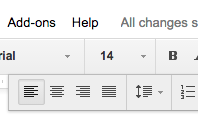

Examples
########

Here are some examples of GGeditor.

+------------------------+-----------------------------+
|Google Docs File        |Generated reST file in Github|
+========================+=============================+
|                        |                             |
+------------------------+-----------------------------+
|                        |                             |
+------------------------+-----------------------------+
|                        |                             |
+------------------------+-----------------------------+
|This is an  |IMG1| image|what [#f1]_ is this          |
+------------------------+-----------------------------+

what [#f2]_ is this

      what [#f3]_       is that

 |IMG2| 

[#f4]_  at the end

.. rubric:: Footnotes

.. [#f1]  This is 1
.. [#f2]  This is 2
.. [#f3]  This is 3
.. [#f4]  This is 4

.. |IMG1| image:: Examples/img_1.png
   :height: 94 px
   :width: 124 px
