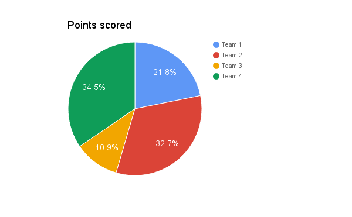
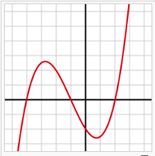

.. _h17cf336a3119355a1c01f75426961:

Examples
********

This is the native Table of Contents of the Google Docs. This is a kind of in-document table of contents.

`Examples <#h17cf336a3119355a1c01f75426961>`_

    `Supported Features List of the GGeditor <#h7d2c3d74f4f672d4f5a723b4c2f4f13>`_

    `Paragraphs <#h1f81a111a3e4cd44467728753e5f73>`_

    `List Item <#h3f7b121e3b34193166765e7a56202b48>`_

    `Table <#h513c5b795d5d185d1c203d7e75205f41>`_

    `Simple Table <#h32215632614d203792b5070562b64f>`_

    `Complex Table <#h5a6e575f7c1d332d6350624c6c73387>`_

    `Image <#h425360541a6d36a14487962c584b8>`_

    `Image with link <#h263145716057721248918325a5e5b>`_

    `Chart <#h1d36783e12317e2c015132250725e7b>`_

    `Admonitions <#h10487d767c3543552c4f797d453d593f>`_

    `Code <#h36d46272a794b2f694b492933796e5e>`_

    `Nested List Item <#h1e7b7c356c1a63272445567d455a317e>`_

    `List Item with Text Styles <#h5f19331f4a2f754d79529747f281b5e>`_

.. _h7d2c3d74f4f672d4f5a723b4c2f4f13:

Supported Features List of the GGeditor
=======================================

+----------------+------------+------------+-------------+-------------+
|Features        |In Paragraph|In List Item|In Table Cell|In Admonition|
+================+============+============+=============+=============+
|Normal Text     |Yes         |Yes         |Yes          |Yes          |
+----------------+------------+------------+-------------+-------------+
|Text alignment  |No          |No          |No           |No           |
+----------------+------------+------------+-------------+-------------+
|Background Color|No          |No          |No           |No           |
+----------------+------------+------------+-------------+-------------+
|Indentation     |Yes         |N/A         |             |No           |
+----------------+------------+------------+-------------+-------------+
|Headings        |Yes         |N/A         |N/A          |N/A          |
+----------------+------------+------------+-------------+-------------+
|Bold            |Yes         |Yes         |Yes          |No           |
+----------------+------------+------------+-------------+-------------+
|Italic          |Yes         |Yes         |Yes          |No           |
+----------------+------------+------------+-------------+-------------+
|Subscript       |Yes         |Yes         |Yes          |No           |
+----------------+------------+------------+-------------+-------------+
|Superscript     |Yes         |Yes         |Yes          |No           |
+----------------+------------+------------+-------------+-------------+
|Hyperlink       |Yes         |Yes         |Yes          |Yes          |
+----------------+------------+------------+-------------+-------------+
|Horizontal Line |Yes         |N/A         |N/A          |N/A          |
+----------------+------------+------------+-------------+-------------+
|Link to bookmark|Yes         |Yes         |Yes          |Yes          |
+----------------+------------+------------+-------------+-------------+
|Link to headings|Yes         |Yes         |Yes          |Yes          |
+----------------+------------+------------+-------------+-------------+
|Footnote        |Yes         |Yes         |Yes          |Yes          |
+----------------+------------+------------+-------------+-------------+
|Inline markup   |Yes         |Yes         |Yes          |Yes          |
+----------------+------------+------------+-------------+-------------+
|Image           |Yes         |Yes         |Yes          |Yes          |
+----------------+------------+------------+-------------+-------------+
|Image with link |Yes         |Yes         |Yes          |Yes          |
+----------------+------------+------------+-------------+-------------+
|Chart           |Yes         |            |             |             |
+----------------+------------+------------+-------------+-------------+
|Admonition      |Yes         |No          |No           |No (Nested)  |
+----------------+------------+------------+-------------+-------------+
|List item       |Yes         |Yes(Nested) |Yes          |Yes          |
+----------------+------------+------------+-------------+-------------+
|Table           |Yes         |No          |No (Nested)  |No           |
+----------------+------------+------------+-------------+-------------+
|Column span     |N/A         |N/A         |No           |N/A          |
+----------------+------------+------------+-------------+-------------+
|Rowspan         |N/A         |N/A         |No           |N/A          |
+----------------+------------+------------+-------------+-------------+
|Table of Content|Yes         |No          |No           |No           |
+----------------+------------+------------+-------------+-------------+

.. _h1f81a111a3e4cd44467728753e5f73:

Paragraphs
==========

The next paragraph contains links, bold, italic, subscript and superscript text, clickable inline image . As well as a paragraph of the same content with indentation.

\ *In mathematics*\ , \ |IMG1|\  a \ **polynomial**\ \ [#F1]_\  is an \ `expression`_\  consisting of \ `variables`_\  (or \ `indeterminates`_\ ) and \ `coefficients`_\ , that involves only the operations of \ `addition`_\ , \ `subtraction`_\ , \ `multiplication`_\ , and non-negative \ `integer`_\  \ `exponents`_\ . An example of a polynomial of a single indeterminate x is x\ :sup:`2`\  − 4x + 7. An example in three variables is x\ :sup:`3`\  + 2xyz\ :sup:`2`\  − yz + T\ :sub:`ab`\ . 

        \ *In mathematics*\ , \ |IMG2|\          a \ **polynomial**\  is an \ `expression`_\  consisting of \ `variables`_\  (or \ `indeterminates`_\ ) and \ `coefficients`_\ , that involves only the operations of \ `addition`_\ , \ `subtraction`_\ , \ `multiplication`_\ , and non-negative\ [#F2]_\          \ `integer`_\  \ `exponents`_\ . An example of a polynomial of a single indeterminate x is x\ :sup:`2`\  − 4x + 7. An example in three variables is x\ :sup:`3`\  + 2xyz\ :sup:`2`\  − yz +  T\ :sub:`ab`\ .

        

.. _h3f7b121e3b34193166765e7a56202b48:

List Item
=========

* \ *In mathematics*\ , \ |IMG3|\  a \ **polynomial**\ \ [#F3]_\  is an \ `expression`_\  consisting of \ `variables`_\  (or \ `indeterminates`_\ ) and \ `coefficients`_\ , that involves only the operations of \ `addition`_\ , \ `subtraction`_\ , \ `multiplication`_\ , and non-negative \ `integer`_\  \ `exponents`_\ . An example of a polynomial of a single indeterminate x is x\ :sup:`2`\  − 4x + 7. An example in three variables is x\ :sup:`3`\  + 2xyz\ :sup:`2`\  − yz + T\ :sub:`ab`\ . 
* \ *In mathematics*\ , \ |IMG4|\  a \ **polynomial**\ \ [#F4]_\  is an \ `expression`_\  consisting of \ `variables`_\  (or \ `indeterminates`_\ ) and \ `coefficients`_\ , that involves only the operations of \ `addition`_\ , \ `subtraction`_\ , \ `multiplication`_\ , and non-negative \ `integer`_\  \ `exponents`_\ . An example of a polynomial of a single indeterminate x is x\ :sup:`2`\  − 4x + 7. An example in three variables is x\ :sup:`3`\  + 2xyz\ :sup:`2`\  − yz + T\ :sub:`ab`\ . 

.. _h513c5b795d5d185d1c203d7e75205f41:

Table
=====

.. _h32215632614d203792b5070562b64f:

Simple Table
------------

+---------------------+--------------------------------+----------------+
|header*              |標題 x\ :sup:`2`\ +y\ :sub:`2`\ |\ `Search`_\    |
+=====================+================================+================+
|In mathematics,      |\ **In mathematics,**\          |In mathe*matics,|
+---------------------+--------------------------------+----------------+
|\ *In mathematics,*\ |In mathematics,                 |                |
+---------------------+--------------------------------+----------------+

.. _h5a6e575f7c1d332d6350624c6c73387:

Complex Table
-------------

+---------------------------------------------------------------------------------------------------------------------------------------------------------------------------------------------------------------------------------------------------------------------------------------------------------------------------------------------------------------------------------------------------------------------------------------------------------------------------------------------------------+------------------------------------------------------------------------------------------------------------------------------------------------------------------------------------------------------------------------------------------------------------------------------------------------------------------------------------------------------------------------------------------------------------------------------------------------------------------------------------------------------------+
|\ *In mathematics*\ , \ |IMG5|\  a \ **polynomial**\ \ [#F5]_\  is an \ `expression`_\  consisting of \ `variables`_\  (or \ `indeterminates`_\ ) and \ `coefficients`_\ , that involves only the operations of \ `addition`_\ , \ `subtraction`_\ , \ `multiplication`_\ , and non-negative \ `integer`_\  \ `exponents`_\ . An example of a polynomial of a single indeterminate x is x\ :sup:`2`\  − 4x + 7. An example in three variables is x\ :sup:`3`\  + 2xyz\ :sup:`2`\  − yz + T\ :sub:`ab`\ . |#. \ *In mathematics*\ , \ |IMG6|\  a \ **polynomial**\ \ [#F6]_\  is an \ `expression`_\  consisting of \ `variables`_\  (or \ `indeterminates`_\ ) and \ `coefficients`_\ , that involves only the operations of \ `addition`_\ , \ `subtraction`_\ , \ `multiplication`_\ , and non-negative \ `integer`_\  \ `exponents`_\ . An example of a polynomial of a single indeterminate x is x\ :sup:`2`\  − 4x + 7. An example in three variables is x\ :sup:`3`\  + 2xyz\ :sup:`2`\  − yz + T\ :sub:`ab`\ . |
|                                                                                                                                                                                                                                                                                                                                                                                                                                                                                                         |#. \ *In mathematics*\ , \ |IMG7|\  a \ **polynomial**\ \ [#F7]_\  is an \ `expression`_\  consisting of \ `variables`_\  (or \ `indeterminates`_\ ) and \ `coefficients`_\ , that involves only the operations of \ `addition`_\ , \ `subtraction`_\ , \ `multiplication`_\ , and non-negative \ `integer`_\  \ `exponents`_\ . An example of a polynomial of a single indeterminate x is x\ :sup:`2`\  − 4x + 7. An example in three variables is x\ :sup:`3`\  + 2xyz\ :sup:`2`\  − yz + T\ :sub:`ab`\ . |
+---------------------------------------------------------------------------------------------------------------------------------------------------------------------------------------------------------------------------------------------------------------------------------------------------------------------------------------------------------------------------------------------------------------------------------------------------------------------------------------------------------+------------------------------------------------------------------------------------------------------------------------------------------------------------------------------------------------------------------------------------------------------------------------------------------------------------------------------------------------------------------------------------------------------------------------------------------------------------------------------------------------------------+
|\ *In mathematics*\ , \ |IMG8|\  a \ **polynomial**\ \ [#F8]_\  is an \ `expression`_\  consisting of \ `variables`_\  (or \ `indeterminates`_\ ) and \ `coefficients`_\ , that involves only the operations of \ `addition`_\ , \ `subtraction`_\ , \ `multiplication`_\ , and non-negative \ `integer`_\  \ `exponents`_\ . An example of a polynomial of a single indeterminate x is x\ :sup:`2`\  − 4x + 7. An example in three variables is x\ :sup:`3`\  + 2xyz\ :sup:`2`\  − yz + T\ :sub:`ab`\ . |* \ *In mathematics*\ , \ |IMG9|\  a \ **polynomial**\ \ [#F9]_\  is an \ `expression`_\  consisting of \ `variables`_\  (or \ `indeterminates`_\ ) and \ `coefficients`_\ , that involves only the operations of \ `addition`_\ , \ `subtraction`_\ , \ `multiplication`_\ , and non-negative \ `integer`_\  \ `exponents`_\ . An example of a polynomial of a single indeterminate x is x\ :sup:`2`\  − 4x + 7. An example in three variables is x\ :sup:`3`\  + 2xyz\ :sup:`2`\  − yz + T\ :sub:`ab`\ .  |
|                                                                                                                                                                                                                                                                                                                                                                                                                                                                                                         |                                                                                                                                                                                                                                                                                                                                                                                                                                                                                                            |
|                                                                                                                                                                                                                                                                                                                                                                                                                                                                                                         |\ *In mathematics*\ , \ |IMG10|\  a \ **polynomial**\ \ [#F10]_\  is an \ `expression`_\  consisting of \ `variables`_\  (or \ `indeterminates`_\ ) and \ `coefficients`_\ , that involves only the operations of \ `addition`_\ , \ `subtraction`_\ , \ `multiplication`_\ , and non-negative \ `integer`_\  \ `exponents`_\ . An example of a polynomial of a single indeterminate x is x\ :sup:`2`\  − 4x + 7. An example in three variables is x\ :sup:`3`\  + 2xyz\ :sup:`2`\  − yz + T\ :sub:`ab`\ .  |
+---------------------------------------------------------------------------------------------------------------------------------------------------------------------------------------------------------------------------------------------------------------------------------------------------------------------------------------------------------------------------------------------------------------------------------------------------------------------------------------------------------+------------------------------------------------------------------------------------------------------------------------------------------------------------------------------------------------------------------------------------------------------------------------------------------------------------------------------------------------------------------------------------------------------------------------------------------------------------------------------------------------------------+

.. _h425360541a6d36a14487962c584b8:

Image
=====

\ |IMG11|\ 

.. _h263145716057721248918325a5e5b:

Image with link
===============

\ |IMG12|\ 

.. _h1d36783e12317e2c015132250725e7b:

Chart
=====

\ |IMG13|\ 

.. _h10487d767c3543552c4f797d453d593f:

Admonitions
===========

.. Attention:: 

    인기 펑크록밴드 그린데이는 20일 열린 아메리칸 뮤직 어워즈 무대에서 트럼프를 맹비난했다. 그린 데이는 전 세계로 중계된 이날 시상식 무대에서 최근 발매된 신곡 '뱅 뱅'을 부르며 "노 트럼프, 노 KKK, 노 파시스트 미국(No Trump, No KKK, No Fascist USA)"라는 구호를 반복해 외쳤다. 그린 데이의 보컬이자 기타리스트인 빌리 조 암스트롱은 이달 초 열린 MTV 유러피안 뮤직 어워즈 현장에서도 트럼프를 히틀러에 비유하며 쓴 소리를 퍼부은 바 있다.

.. Caution:: 

    ＮＨＫが各地の消防に取材したところ、午後１時半現在、この地震で、千葉県で８２歳の女性が足の骨を折る大けがをするなど、４つの都県で合わせて１２人がけがをしたということです。けがをした人の内訳は、福島県で５人、千葉県で４人、東京で２人、宮城県で１人となっています。

.. Danger:: 

    今年9月，一張具有重要歷史意義的越戰照片「燒夷彈女孩」（Napalm Girl），但Facebook宣稱不該發布裸露的女孩照片，並將上傳者帳號停權。
    這引發了另一位挪威編輯不滿，他寫了一封公開信表示「Zuckerberg（臉書CEO）分不清楚歷史的重要照片及色情裸露圖片的不同，恣意的進行內容審查」
    臉書已經成為10幾億人的資訊來源，如果它開始恣意下架訊息，這會不會是新白色恐怖？

.. Error:: 

    (content of error)

.. Hint:: 

    (content of hint)

.. Important:: 

    (content of important)

.. Note:: 

    (content of note)

.. Tip:: 

    (content of tip)

.. Warning:: 

    (content of warning)

.. Note:: 

        def start(x):
            go start
            go end

    def end(y)
        go \ `end`_\  start
        \ **go**\  end end

.. _h36d46272a794b2f694b492933796e5e:

Code
====

.. Code:: 

        def start(x):
            go start
            go end

    def end(y)
        go end start
        go end end

.. _h2c1d74277104e41780968148427e:

.. _h1e7b7c356c1a63272445567d455a317e:

Nested List Item
================

* item 1

    #. item 1.1
    #. item 1.2

        * Item a
        * Item b
        * Item c

    #. item 1.3

.. _h5f19331f4a2f754d79529747f281b5e:

List Item with Text Styles
==========================

* item 1

    #. item 1.\ :sup:`1  `\ with superscript
    #. \ *item*\  1.\ :sup:`12 `\ with superscript
    #. \ **item**\  1.\ :sub:`34 `\ with subscript

* item 2

    #. Item with \ `link`_\ 
    #. item with a image \ |IMG14|\ 

* item 3

    #. item\ [#F11]_\  with footnote
    #. item\ [#F12]_\  with footnote

\ `Here is the source document of the Google Docs`_\ 

.. _`expression`: https://en.wikipedia.org/wiki/Expression_(mathematics)
.. _`variables`: https://en.wikipedia.org/wiki/Variable_(mathematics)
.. _`indeterminates`: https://en.wikipedia.org/wiki/Indeterminate_(variable)
.. _`coefficients`: https://en.wikipedia.org/wiki/Coefficient
.. _`addition`: https://en.wikipedia.org/wiki/Addition
.. _`subtraction`: https://en.wikipedia.org/wiki/Subtraction
.. _`multiplication`: https://en.wikipedia.org/wiki/Multiplication
.. _`integer`: https://en.wikipedia.org/wiki/Integer
.. _`exponents`: https://en.wikipedia.org/wiki/Exponentiation
.. _`Search`: http://www.google.com
.. _`end`: http://www.google.com
.. _`link`: http://www.google.com
.. _`Here is the source document of the Google Docs`: https://docs.google.com/document/d/1WmPTmyJmenxPaWQUluPGskkqqwTsrlGjGf5DzTX4tpQ/edit?usp=sharing

.. rubric:: Footnotes

.. [#f1]  Polynomial is poly+nomial
.. [#f2]  Non-negative is positive and zero
.. [#f3]  Polynomial is poly+nomial
.. [#f4]  Polynomial is poly+nomial
.. [#f5]  Polynomial is poly+nomial
.. [#f6]  Polynomial is poly+nomial
.. [#f7]  Polynomial is poly+nomial
.. [#f8]  Polynomial is poly+nomial
.. [#f9]  Polynomial is poly+nomial
.. [#f10]  Polynomial is poly+nomial
.. [#f11]  This is a footnote of a list item
.. [#f12]  This is another footnote of a list item

.. |IMG1| image:: static/Examples_1.png
   :height: 73 px
   :width: 73 px
   :target: http://www.google.com

.. |IMG4| image:: static/Examples_4.png
   :height: 73 px
   :width: 73 px
   :target: http://www.google.com

.. |IMG5| image:: static/Examples_5.png
   :height: 73 px
   :width: 73 px
   :target: http://www.google.com

.. |IMG7| image:: static/Examples_7.png
   :height: 73 px
   :width: 73 px
   :target: http://www.google.com

.. |IMG8| image:: static/Examples_8.png
   :height: 73 px
   :width: 73 px
   :target: http://www.google.com

.. |IMG9| image:: static/Examples_9.png
   :height: 73 px
   :width: 73 px
   :target: http://www.google.com

.. |IMG10| image:: static/Examples_10.png
   :height: 73 px
   :width: 73 px
   :target: http://www.google.com

.. |IMG11| image:: static/Examples_11.png
   :height: 150 px
   :width: 150 px

.. |IMG12| image:: static/Examples_12.png
   :height: 150 px
   :width: 150 px
   :target: http://www.google.com

