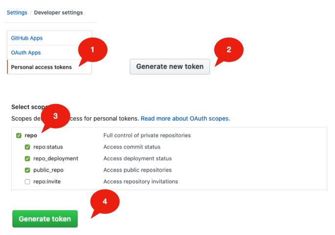

.. _h49281ff34182021263e7c123f76565a:

Github Bad Credentials
######################

\ |LINK1|\  API for bare username and password, that is the root cause of "Bad Credentials" problem. The solutions is easy, just replace your password with "personal access token" when doing commit in the GGEditor.

.. _h2e3b2e60702d14311247725d761f38:

Steps: 
*******

#. \ |LINK2|\  in the Github.com and create a personal access token in Github.com. (\ |LINK3|\ )

#. Copy the personal access token

#. Open a Google Document and remove all stored credentials in the GGEditor

#. Commit the Google Document with your Github account (email) and the copied token as your password.

.. _h2a191b491440121e50c5a58163c1e5:

Diagrams:
*********

.. _h6f4a225b2940695663301c471fc547f:

Step 1
======

\ |IMG1|\ 

.. bottom of content

.. |LINK1| raw:: html

    <a href="https://developer.github.com/changes/2019-11-05-deprecated-passwords-and-authorizations-api/#authenticating-using-query-parameters" target="_blank">Github has deprecated its authentication</a>

.. |LINK2| raw:: html

    <a href="https://github.com/settings/tokens" target="_blank">Go to your settings page</a>

.. |LINK3| raw:: html

    <a href="https://help.github.com/en/github/authenticating-to-github/creating-a-personal-access-token-for-the-command-line" target="_blank">How to by Github</a>

