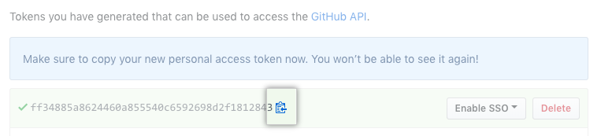

.. _h49281ff34182021263e7c123f76565a:

Github Bad Credentials
######################

\ |LINK1|\  API for bare username and password, that is the root cause of "Bad Credentials" problem. The solutions is easy, just replace your password with "personal access token" when doing commit in the GGEditor.

.. _h2e3b2e60702d14311247725d761f38:

Steps: 
*******

#. \ |LINK2|\  in the Github.com and create a personal access token in Github.com. (\ |LINK3|\ ) and copy the personal access token into your clipboard.

#. Open a Google Document and remove all stored credentials in the GGEditor, then add a new account with the copied token as your password.

#. You have done.

.. _h2a191b491440121e50c5a58163c1e5:

Diagrams:
*********

.. _h77352a29556f454d4d19191f73a354:

Step 1: Generate a personal access token and copy it. (\ |LINK4|\ )
===================================================================

\ |IMG1|\ 

Please do copy at this stage, the Github won't show it twice. But don't worry, if you missed, just to generate it again.

\ |IMG2|\ 

.. _h3d3873115f334f1c4673f1867473d26:

Step 2: Reset credentials in the GGEditor
=========================================

From the menubar item of the GGeditor, select "Settings"

\ |IMG3|\ 

Delete stored credientails and add a new account.

\ |IMG4|\ 

With the copied personal access token as the password

\ |IMG5|\ 

.. _h6b315151335b1a24393964623ab585:

Step 3. You have done. Try it!
==============================

\ |IMG6|\ 

.. bottom of content

.. |LINK1| raw:: html

    <a href="https://developer.github.com/changes/2019-11-05-deprecated-passwords-and-authorizations-api/#authenticating-using-query-parameters" target="_blank">Github has deprecated its authentication</a>

.. |LINK2| raw:: html

    <a href="https://github.com/settings/tokens" target="_blank">Go to your settings page</a>

.. |LINK3| raw:: html

    <a href="https://help.github.com/en/github/authenticating-to-github/creating-a-personal-access-token-for-the-command-line" target="_blank">How to by Github</a>

.. |LINK4| raw:: html

    <a href="https://github.com/settings/tokens" target="_blank">Go to your settings page</a>

.. |IMG1| image:: static/Github_Bad_Credentials_1.png
   :height: 480 px
   :width: 684 px

