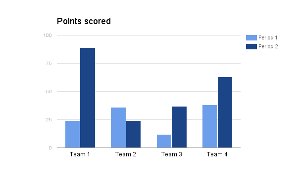

.. _h1a461f6b1275321a16291dd169a6c:

Limitations
###########

.. _h19176e602c6c3f6828a7e207b523e9:

Unsupported Google Docs Features:
*********************************

The Google Docs is a powerful editor, but not all features are supported to convert to reST markups. Below is the list (included but not limited to)

+-+-----------+
|a|b          |
+-+-----------+
|d|c\ |IMG1|\ |
+-+-----------+

* Comments. This is not supported by the reST.
* Drawing objects. Because there is no API to get it as an image.
* List styles. The list style is defined by the CSS settings in the html page.
* Math equations. Because this is no API to get it as an image.
* Multi-columns. This is not supported by the reST.\ |IMG2|\ 
* Page break. This is not able to apply to a html page.
* Page header and page footer. This is not supported by the reST.
* Page numbering. This is not able to apply to a html page.

.. _h65776f3b486b79192426655c476e97b:

Known Issues:
*************

.. _h1f753e737333503f6591234143cc4:

reStructuredText related
========================

* Table in a list item is not supported. It will be converted to a stand-alone table.
* Nested table in a table cell is not supported.
* Video is not supported. The Google Docs does not allow to embed videos neither.

.. _h69271f6b544a4942467e713a34332e47:

Github related
==============

* When repository was renamed:

    * If the repository or folder name of the binding file in Github was renamed, a re-binding is required for committing.

* When the binding file has changed

    * If the binding file has changed, according to the new binding name, a new  image subfolder might be created. Which means the original image subfolder should be removed manually.

