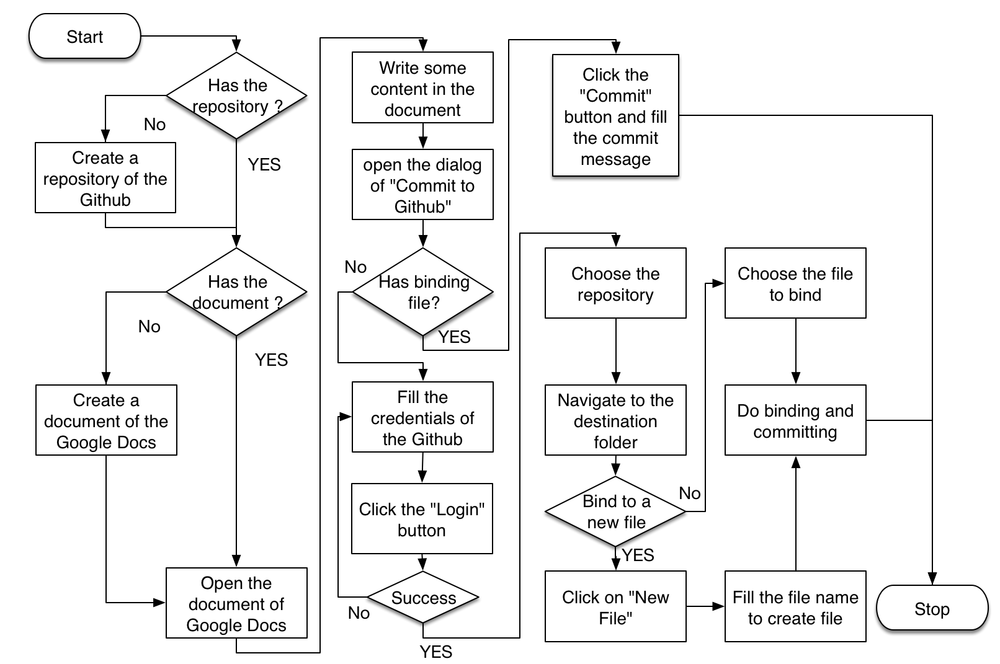
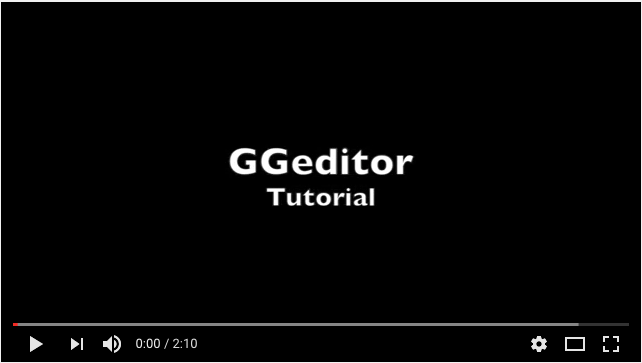

(\ |LINK1|\  Video for Taiwanese users in Mandarin)

..  Attention:: 

    For GGeditor installed after Jan 15, 2017:
    
    GGeditor added support for multiple accounts in this release. But this tutorial is not yet updated:
    
    Before your first committing to Github, you must go to the "Settings" panel and set an account.

.. _h36711971261f3518968783337294a20:

Tutorial
********

GGeditor assumes a scenario where:

#. You already have a project repository in the Github, and

#. You already have a project in the readthedocs.org which corresponds to that repository. 

- Create a Google Docs document written in Markdown or reStructuredText formats.
- Push a copy of the latest GDoc document revision to a file in a Github repository which ReadTheDocs.org renders into HTML and PDF.
  - (Note that while GitHub supports many lightweight markup languages, Readthedocs.org only supports (Sphinx) reStructuredText and Markdown.)
- Collaboratively build documentation in Markdown or reStructuredText formats.

This is the flow chart of working with the GGeditor to build your documentation:

\ |IMG1|\ 

This tutorial would only go through the longest route in the flow chart. Here are the sequences of what are been demonstrated in this tutorial :

#. The tutorial will start from creating a new document in the Google Docs.

#. The new file will be named “Tutorial”. It has a heading, an image and an admonition created from the sidebar of the GGeditor.

#. The new file will be commit to the Github repository, in this demo, it is the repository of the GGeditor.

#. Because this is a new file, a process will be initiated for binding. It includes to log-in, navigate, create new file and commit.

It’s done for the “Tutorial” document.

..  Warning:: 

    For CKJ users: (繁體中文、简体中文、한국어、日本語)
    
    English document name is strongly suggested for naming your documents. Especially when the document contains images because images got pathname from their hosting document. Naming document in English would reduce risk of parsing failure in the readthedocs.org.

We also want the document “Tutorial”  to be listed on the menu in the readthedocs.org project site. We have to add an item within the “toctree” in the index.rst. So there are extra steps when a new file was created:

#. Open the index.rst and add the new filename (“Tutorial”) in the table of toctree.

#. Commit the index.rst to the Github.  Because the index.rst already has a binding file, we just need to click the “Commit” button.

It’s done for updating the index.rst. 

If a document already has a binding file, the process is simple, just to  open, edit and commit. This tutorial ends up by checking the project site in reatthedocs.org. You will see the content of this new document “Tutorial” is on the project site of the readthedocs.org. We don’t need to do anything on the Github or the readthedocs.org. The readthedocs.org will automatically rebuild your project site when the corresponding repository move forward.

Here is the video of this tutorial:

\ |IMG2|\ 

..  Note:: 

    #. When you name the Google Docs document, the name need not with suffix  “.rst”.
    
    #. But the binding file in the Github repository do need with suffix “.rst”. It will be automatically appended when the GGeditor created it. If you manually created the binding file, please name it with suffix “.rst”.
    
    #. in this tutorial video, the committing of index.rst does not also commit images. That is because the changes include text part only.  By un-checking the “Commit images” option, the committing only updates the generated reStructuredText content of the index.rst. That makes the time of committing being shorter.

\ |LINK2|\ 

.. bottom of content

.. |LINK1| raw:: html

    <a href="https://goo.gl/qH1WWj" target="_blank">台灣使用者請點我開啟中文版</a>

.. |LINK2| raw:: html

    <a href="https://docs.google.com/document/d/1V2Xync2yY9YYDHX6NJ5HXMekSnIIBi5035ephlAdJxA/edit?usp=sharing" target="_blank">The source document of this page in the Google Docs</a>

