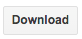
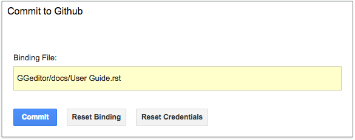

.. _h177537546887b67276822514c66016:

How to Use
##########

.. _h2e2466207319265a2b484631c11587d:

The Google Docs Native Features
*******************************

Most features are just using the Google Docs’ native features. Such as

* Paragraph heading and indentation
* Bold , Italic, subscript and superscript
* List and numbered list
* Table
* Image and chart
* Footnote, hyperlink and bookmark
* Table of contents (links to bookmarks and headings)
* Horizontal line, special characters and CKJ full-width characters

.. _h80352f65a46575c6a74721e3ddb6a:

Inline Markups
**************

Some inline reST markups can be used directly in the document. The table shows all the usable inline markups.

+---------------------------+--------------------------------+
|In Google Docs document    |Rendered in html page           |
+===========================+================================+
|A \`single back-quote\`    |A `single back-quote`           |
+---------------------------+--------------------------------+
|A \`\`double back-quote\`\`|A ``double back-quote``         |
+---------------------------+--------------------------------+
|A \|replacement\| markup   |A |replacement| markup\ [#F1]_\ |
+---------------------------+--------------------------------+
|Text with \*\*emphasis\*\* |Text with **emphasis**          |
+---------------------------+--------------------------------+

.. |replacement| replace::   **replacement**

.. _h6c5e5e24234f72422a2ce37561f2355:

Markup Panel
************

\ |IMG1|\ 

Besides the above list, you have more features by click the ``Show Markup Panel`` or the ``Commit to Github`` on the Add-ons/GGeditor menuitem.

This “Show Markup Panel” helps you to insert special markups and convert the document into reST file. There are three tabs in the panel.

.. _h1953454269561c41621765787c257114:

Markup Tab
==========

\ |IMG2|\ 

This tab is for adding admonitions, directives and cross-document “table of contents”.

.. _h10487d767c3543552c4f797d453d593f:

Admonitions
===========

\ `Admonition`_\  is something like this:

.. Attention:: 

    Here is the content of this attention

Click on the admonition name, then it will be inserted as a table into your document.

.. _h5a3b1c203613551578563c31657026b:

Directives
==========

\ `Directive`_\  is the generic form of admonition and many other reST Markups.

.. _h13a5d3e27e111c18554152c6d123c:

Generic Directive
-----------------

 ``Generic directive`` can be used for all kinds of directive. It will give you a table like below, you should replace all the placeholder to fit your needs.

\ |IMG3|\ 

This is an example of directive ``toctree``.

\ |IMG4|\ 

Please be noted that “name” and “content” is required, arguments and options are not. If there is no arguments, the placeholder should be removed. If there is no options, the options row (2nd row) can be deleted. If there is more than one options, they should be put line by line or row by row. 

\ |IMG5|\ 

This is the reST generated from the above table.

\ |IMG6|\ 

You have to replace the name and content for your own purpose. One of the usage is to create customized admonition. The following directive table will create a ``And, by the way…`` dialog for you.

Below is how it is rendered in a web page.

.. admonition:: And, by the way...

    Here is your content

.. _h36d46272a794b2f694b492933796e5e:

Code
----

``code`` is for holding sample codes.

\ |IMG7|\ 

You can highlight your code by giving a language after \.\.code::, like this:

\ |IMG8|\ 

.. _ha1d6c3e373325355168491f521a78b:

Table of Contents
-----------------

``Table of Contents`` will insert \ `a sphinx toctree`_\ , aka cross-document table of contents. Usually, this is inserted into the ``index.rst``.  All the documents with suffix .rst in the same folder will be inserted into the 3rd row. You have to adjust their order manually. Below is an example:

\ |IMG9|\ 

If a document was binding to another name, the binding name will be used. The document containing the table is not in the list for preventing from infinite loop while parsing. You should add it back manually if that makes sense for you.

The “maxdepth:2” means to build the sidebar based on “Parts” and “Chapter”.

.. _h5a807c1a4a7d71c65729517f5c5635:

Style Tab
=========

\ |IMG10|\ 

This panel help user to adding headings to paragraphs. The headings construct the structure of the document. This panel shows the mapping of terminology between the Google Docs and the reStructuredText specification.

\ |IMG11|\ 

The lower section “Paragraph” is for styling normal text. ``Paragraph Content`` is for resetting style to normal text, ``Directive Content`` is for setting style to monospace. These two are usually used when you paste stuffs from other browser pages into the document.

.. _h6978575a60223f496c263254a447d32:

Conversion Tab
==============

\ |IMG12|\ 

The Conversion tab has two buttons. The “Generate reST” will trigger the generating process and show the result in the area below that button.

The “Download” button let you download the generated reST and images in a zip file into your local PC.

.. _h76464c5c585d192b16121e3267e131:

Commit to Github
****************

.. _h767f774b5346d4195e437b31414f59:

Binding the document to a file in repository
============================================

You can provide your account and credentials for binding the document to a file in the Github repository. Here is the process diagram:

\ |IMG13|\ 

If you want to commit to a new file. Please

#. Navigate to the folder where the new file would be
#. Click on the “New File” item
#. Give the file name to create. The name will be suffix with “.rst” automatically.

.. _h572153e49969743e69262f2d637743:

Committing
==========

\ |IMG14|\ 

Once you have build the binding, next time you can use the “Commit” button directly to commit. You can reset the binding in this dialog too.

.. _hb3e386c1329112c3f734c345c3396b:

About the Credentials
=====================

The credentials you given is encrypted and kept in the Google App Script platform. No any cloud server is built by the GGeditor.  You can uncheck “Remeber Github Credentials” checkbox or “Reset Credentials” button to clean up the stored credentials.

\ |IMG15|\ 

\ |IMG16|\ 

You just need to give the credentials every time for committing. Like the following image shows.

\ |IMG17|\ 

.. _`Admonition`: http://read-the-docs.readthedocs.io/en/latest/_themes/sphinx_rtd_theme/demo_docs/source/demo.html?highlight=ADMONITION#admonitions
.. _`Directive`: http://docutils.sourceforge.net/docs/ref/rst/directives.html
.. _`a sphinx toctree`: http://www.sphinx-doc.org/en/1.4.8/markup/toctree.html

.. rubric:: Footnotes

.. [#f1]  If you manually put a substitution markup, you got to provide the replacement markup manu

.. |IMG1| image:: User_Guide/User_Guide_1.png
   :height: 105 px
   :width: 402 px

.. |IMG2| image:: User_Guide/User_Guide_2.png
   :height: 497 px
   :width: 309 px

.. |IMG3| image:: User_Guide/User_Guide_3.png
   :height: 156 px
   :width: 458 px

.. |IMG4| image:: User_Guide/User_Guide_4.png
   :height: 280 px
   :width: 426 px

.. |IMG5| image:: User_Guide/User_Guide_5.png
   :height: 392 px
   :width: 625 px

.. |IMG6| image:: User_Guide/User_Guide_6.png
   :height: 181 px
   :width: 185 px

.. |IMG7| image:: User_Guide/User_Guide_7.png
   :height: 68 px
   :width: 560 px

.. |IMG8| image:: User_Guide/User_Guide_8.png
   :height: 108 px
   :width: 558 px

.. |IMG9| image:: User_Guide/User_Guide_9.png
   :height: 153 px
   :width: 357 px

.. |IMG10| image:: User_Guide/User_Guide_10.png
   :height: 326 px
   :width: 312 px

.. |IMG11| image:: User_Guide/User_Guide_11.png
   :height: 89 px
   :width: 240 px

.. |IMG12| image:: User_Guide/User_Guide_12.png
   :height: 482 px
   :width: 312 px

.. |IMG13| image:: User_Guide/User_Guide_13.png
   :height: 545 px
   :width: 664 px

.. |IMG14| image:: User_Guide/User_Guide_14.png
   :height: 232 px
   :width: 584 px

.. |IMG16| image:: User_Guide/User_Guide_16.png
   :height: 38 px
   :width: 128 px

