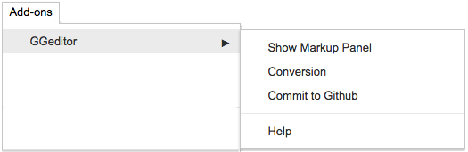
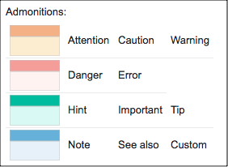
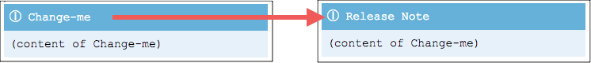
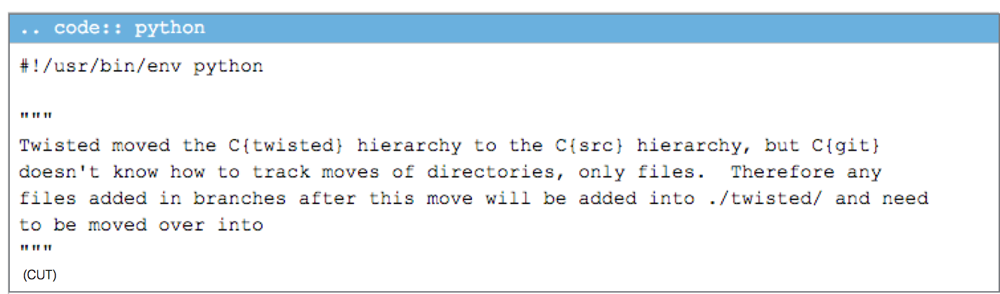
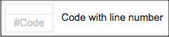
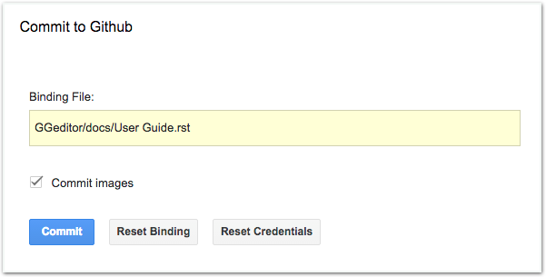
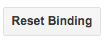

.. _h177537546887b67276822514c66016:

How to Use
**********

.. _h2e2466207319265a2b484631c11587d:

The Google Docs Native Features
===============================

You can use the following list native features of the Google Docs to build your content for generating reStructuredText format.

* Paragraph heading and indentation
* Bold, Italic, subscript and superscript
* List and numbered list
* Table
* Image and chart
* Footnote, hyperlink and bookmark
* Table of contents (links to bookmarks and headings)
* Special characters and CKJ full-width characters

.. Note:: 

    A hyperlink will be opened in a new window(tab) if its URL is of format “scheme://…”, like http://, https://, etc.

.. _h80352f65a46575c6a74721e3ddb6a:

Inline Markups
==============

Some inline reStructuredText markups can be used directly in the document. The table demonstrates the usage example of these inline markups.

+---------------------------+-----------------------+
|\ |STYLE0|\                |\ |STYLE1|\            |
+===========================+=======================+
|A \`single back-quote\`    |A `single back-quote`  |
+---------------------------+-----------------------+
|A \`\`double back-quote\`\`|A ``double back-quote``|
+---------------------------+-----------------------+
|A \|replacement\| markup   |A |replacement| markup |
+---------------------------+-----------------------+
|Text with \*\*emphasis\*\* |Text with **emphasis** |
+---------------------------+-----------------------+

.. |replacement| replace::   **replaced**

.. Hint:: 

    If you manually put a substitution markup, you got to provide the replacement markup manually. Below is the source of above table, you can put the replacement markup. The last line shows an example of inline replacement markup.
    
    \ |IMG1|\ 
    
    

.. _h513c5b795d5d185d1c203d7e75205f41:

Table
=====

The Google Docs native table can be converted to reStructuredText table. One thing must mention is that, if you want to generate header rows in the generated reStructuredText table, you have to make all text in the header rows to be bold.

\ |IMG2|\ 

This is the rendered table of the above content.

+------------+------------+------------+
|\ |STYLE2|\ |\ |STYLE3|\ |\ |STYLE4|\ |
+============+============+============+
|Normal Row  |Normal Row  |Normal Row  |
+------------+------------+------------+
|Normal Row  |Normal Row  |Normal Row  |
+------------+------------+------------+

.. Hint:: 

    You can set background-color for header rows by assign CSS in the /docs/static/theme_overrides.css. For example:
    
    .wy-table-responsive table th {
       background-color: #f0f0f0;
    }

.. _h425360541a6d36a14487962c584b8:

Image
=====

Images and charts in the Google Docs document are able to be converted to the generated reStructuredText file bundles. Here is the naming rules:

#. A folder named “static” will be created if necessary in the same folder of the document.
#. All the images in the document will be stored in the “static” folder in PNG format. 
#. The image name is the document name + underscore + sequence number + ‘.png’

All images will be re-generated if “Commit images” was checked. That is, the mapping between image content and image name might not be constant.

.. Warning:: 

    For CKJ users: (繁體中文、简体中文、한국어、日本語)
    
    English document name is strongly suggested for naming your documents. Especially those documents with images because an image got pathname from its hosting document. By naming document in English, it would reduce the risk of parsing failure in the readthedocs.org.

.. Note:: 

    Currently, it seems the sphinx parser has problem on parsing :align: of an image markup, image horizontal alignment is not supported yet. 

.. _h6c5e5e24234f72422a2ce37561f2355:

Markup Panel
============

\ |IMG3|\ 

Besides the native features, you have more features by click the ``Show Markup Panel`` or the ``Commit to Github`` on the Add-ons/GGeditor menu item.

The “Show Markup Panel” helps you to insert special markups, to see the converted content in reStructuredText, or to download the generated files.

.. _h10487d767c3543552c4f797d453d593f:

Admonitions
-----------

\ |IMG4|\ 

\ |LINK1|\  is something like this:

.. Attention:: 

    Here is the content of this attention

The GGeditor try to set the look-and-feel of admonitions to be as close as possible to what they are in the readthedocs.org. There are 4 kinds of layout for 10 types of admonitions. Please click on the admonition name to insert them into your document.

.. _h5a3b1c203613551578563c31657026b:

Directives
----------

\ |IMG5|\ 

\ |LINK2|\  is the generic form of admonition and many other reST Markups.

.. _h13a5d3e27e111c18554152c6d123c:

Generic Directive
~~~~~~~~~~~~~~~~~

 ``Generic directive`` can be used for all kinds of reST directive. It will give you a table as shown below, you should replace all the placeholder to fit your needs.

\ |IMG6|\ 

The following table is an example of the directive ``toctree``.

\ |IMG7|\ 

Please be noted “name” and “content” are required for a directive, arguments and options are optional. If there are no options, the content can be in the 2nd row. If there is more than one options, these options should be put line by line in 2nd row, or row by row. See the diagram below for illustration. 

\ |IMG8|\ 

This is the reST generated from the above table.

\ |IMG9|\ 

You have to replace the name and content for your own purpose. One of the usage is to create customized admonition. The following directive table will create a ``And, by the way…`` dialog for you.

\ |IMG10|\ 

Below is how it is rendered in the web page.

.. admonition:: And, by the way...

    Here is your content

.. _h36d46272a794b2f694b492933796e5e:

Code
~~~~

``code`` is for holding sample codes.

\ |IMG11|\ 

The content in a code directive cannot be in bold or italic. Neither hyperlinks and images.

You can highlight your code by giving a language name after the \.\.code::, like this: (there is a space in front of “python”)

\ |IMG12|\ 

It is rendered like this:

.. code:: python

    #!/usr/bin/env python
    
    """
    Twisted moved the C{twisted} hierarchy to the C{src} hierarchy, but C{git}
    doesn't know how to track moves of directories, only files.  Therefore any
    files added in branches after this move will be added into ./twisted/ and need
    to be moved over into 
    """
    
    import os
    from twisted.python.filepath import FilePath
    
    here = FilePath(__file__).parent().parent()
    fromPath = here.child("twisted")
    toPath = here.child("src")
    
    for fn in fromPath.walk():
        if fn.isfile():
            os.system("git mv {it} src/{it}"
                      .format(it="/".join(fn.segmentsFrom(here))))
    
    os.system('git clean -fd')

.. _ha1d6c3e373325355168491f521a78b:

Table of Contents
~~~~~~~~~~~~~~~~~

In the panel, the Table of Contents will insert \ |LINK3|\ , aka cross-document table of contents to the cursor position. Usually, it was inserted into the ``index.rst`` document.  The rules of what filename been included in the auto generated toctree table are:

#. All the documents with suffix .rst in the same folder of this document. Even the document is not binding to a file in the Github.
#. If a document is binding to a file in the Github, the filename will be used. Even the source document is not with suffix “.rst”.
#. The current document is excluded. This is for preventing from falling into an infinite loop while the readthedocs parsing this table. You should add it back manually if that makes sense for you.

 Here is an example of what it looks like:

\ |IMG13|\ 

Please be noted the file suffix (.html or .rst) has been omitted. Also, you have to change their order manually.  You have to manually edit the list content in the 3rd row when you add or remove your documents. Maybe you can just ask the GGeditor to generate a new doctree table and remove the existing one. You can refer to \ |LINK4|\  of the GGeditor for an example.

.. _h545b1150273f784141121a3967491529:

Headings
~~~~~~~~

\ |IMG14|\ 

The headings construct the structure of the document. If you put the cursor in a paragraph you can set the heading for that paragraph with this panel. You can click on the upper parts (like Part, Chapter) or use the native heading tools of the Google Docs. The lower parts of this panel shows the relative headings in the Google Docs.

.. _h48253316368583f7c154246e606b2f:

Text Style
~~~~~~~~~~

\ |IMG15|\ 

By putting the cursor in a paragraph you can change the text style of that paragraph. The `Paragraph Content` is for normal text, `Directive Content` is for code style (monospace). These two are usually used when you paste stuffs from other browser pages into your document.

.. _hf552270633f3791039513f635f55:

Misc Utilities
~~~~~~~~~~~~~~

This is a panel for features that are not been classified to the above categories.

+----------------------+----------------------------------------------------------------------------------------------------------------------------------------------------------------------------------------------------------------------------------------------------------------------------+
|\ |STYLE5|\           |\ |STYLE6|\                                                                                                                                                                                                                                                                 |
+======================+============================================================================================================================================================================================================================================================================+
|Add link to document  |Add a link of markup to other Google Docs document for selected text. Once clicked, a list of name of Google Docs will be prompted for your choice. Like this:                                                                                                              |
|                      |                                                                                                                                                                                                                                                                            |
|                      |\ |IMG16|\                                                                                                                                                                                                                                                                  |
|                      |                                                                                                                                                                                                                                                                            |
|                      |Please be noted:                                                                                                                                                                                                                                                            |
|                      |                                                                                                                                                                                                                                                                            |
|                      |#. only files in the same folder of the current document will be listed.                                                                                                                                                                                                    |
|                      |#. The Google Docs does not allow relative URL, so the added URL will be a pseudo-URL which starts with “http://cross.document/”, please keep the pseudo header when you are manually editing it. The pseudo-URL will be converted to relative-URL when generating the reST.|
+----------------------+----------------------------------------------------------------------------------------------------------------------------------------------------------------------------------------------------------------------------------------------------------------------------+
|Upgrade all headings  |All the paragraphs with headings will increase one level of heading. That is, Heading 2 becomes Heading 1, and Heading 1 becomes Title. Heading 6 becomes Heading 5. Title keeps Title.                                                                                     |
|                      |                                                                                                                                                                                                                                                                            |
|                      |This is useful when you dealing with depth level about what will be listed on the sidebar of the readthedocs project.                                                                                                                                                       |
+----------------------+----------------------------------------------------------------------------------------------------------------------------------------------------------------------------------------------------------------------------------------------------------------------------+
|Downgrade all headings|All the paragraphs with headings will decrease one level of heading. That is, Heading 1 becomes Heading 2, and Title becomes Heading 1.  Heading 5 becomes Heading 6. Heading 6 keeps Heading 6.                                                                            |
+----------------------+----------------------------------------------------------------------------------------------------------------------------------------------------------------------------------------------------------------------------------------------------------------------------+

.. _h6978575a60223f496c263254a447d32:

Conversion Tab
--------------

The Conversion tab has two buttons. 

\ |IMG17|\ 

The “Generate reST” will trigger the generating process and show the result in the area below that button.

\ |IMG18|\ 

The “Download” button let you download the generated reStructuredText file and images in a zip file into your local PC.

.. _h76464c5c585d192b16121e3267e131:

Commit to Github
================

.. _h767f774b5346d4195e437b31414f59:

Binding the document to a file in repository
--------------------------------------------

You can provide your account credentials for binding the document to a file in the Github repository. Here is the process diagram:

\ |IMG19|\ 

If you want to commit to a new file. Please

#. Navigate to the folder where the new file would be
#. Click on the “New File” item
#. Give the file name to create. The name will be suffix with “.rst” automatically.

.. Hint:: 

    While doing any clicking, ONE click is enough. No need to do “Double-Clicking”.

.. _h2c1d74277104e41780968148427e:

.. _h572153e49969743e69262f2d637743:

Committing
----------

\ |IMG20|\ 

Once you have build the binding, next time you can use the “Commit” button directly to commit. You can reset the binding in this dialog too.

\ |IMG21|\ 

The “Rest Binding” is for rebinding the file in Github repository with this document.

\ |IMG22|\ 

If only the text content has been modified, you can un-check the “Commit images” to exclude images from committing. This would speed up the committing process.

.. Note:: 

    The GGeditor will maintain image files it uploaded to the Github repository while committing. If you modified any image, no matter adding, replacement or deletion, you should check “Commit images”.

.. _hb3e386c1329112c3f734c345c3396b:

About the Credentials
---------------------

Given credentials is encrypted and kept in the Google App Script platform. None cloud server is built by the GGeditor.  You can un-check the “Remeber Github Credentials” checkbox or the “Reset Credentials” button to clean up the stored credentials.

\ |IMG23|\ 

\ |IMG24|\ 

.. Caution:: 

    The GGeditor will never sent you email to request reset credentials or anything else.

You can give the credentials every time doing the committing. Like the following image shows.

\ |IMG25|\ 

\ |LINK5|\  

.. |STYLE0| replace:: **In Google Docs document**

.. |STYLE1| replace:: **Rendered in HTML page**

.. |STYLE2| replace:: **Header Row**

.. |STYLE3| replace:: **Header Row**

.. |STYLE4| replace:: **Header Row**

.. |STYLE5| replace:: **Name**

.. |STYLE6| replace:: **Description**

.. |LINK1| raw:: html

    <a href="http://read-the-docs.readthedocs.io/en/latest/_themes/sphinx_rtd_theme/demo_docs/source/demo.html?highlight=ADMONITION#admonitions" target="_blank">Admonition</a>

.. |LINK2| raw:: html

    <a href="http://docutils.sourceforge.net/docs/ref/rst/directives.html" target="_blank">Directive</a>

.. |LINK3| raw:: html

    <a href="http://www.sphinx-doc.org/en/1.4.8/markup/toctree.html" target="_blank">a sphinx toctree</a>

.. |LINK4| raw:: html

    <a href="https://docs.google.com/document/d/13b5dr8TZoTC5IJZeoiDt066b6mwq67yHqcl4TYUFnk0/edit?usp=sharing" target="_blank">the source document of the index.rst</a>

.. |LINK5| raw:: html

    <a href="https://docs.google.com/document/d/1D2Q53jiQyOoSoqsNhTQuoRb1d2XlIJURgPz2OqrX0DE/edit?usp=sharing" target="_blank">Here is the source document of this page</a>

.. |IMG2| image:: static/User_Guide_2.png
   :height: 266 px
   :width: 457 px

.. |IMG9| image:: static/User_Guide_9.png
   :height: 130 px
   :width: 140 px

.. |IMG10| image:: static/User_Guide_10.png
   :height: 93 px
   :width: 496 px

.. |IMG11| image:: static/User_Guide_11.png
   :height: 90 px
   :width: 753 px

.. |IMG12| image:: static/User_Guide_12.png
   :height: 221 px
   :width: 753 px

.. |IMG16| image:: static/User_Guide_16.png
   :height: 236 px
   :width: 246 px

.. |IMG17| image:: static/User_Guide_17.png
   :height: 36 px
   :width: 108 px

.. |IMG19| image:: static/User_Guide_19.png
   :height: 545 px
   :width: 664 px

.. |IMG20| image:: static/User_Guide_20.png
   :height: 304 px
   :width: 600 px

.. |IMG21| image:: static/User_Guide_21.png
   :height: 40 px
   :width: 105 px

