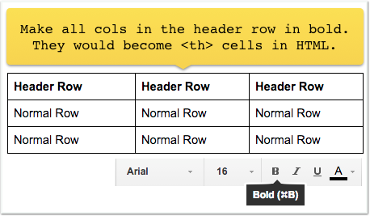
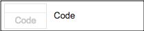

.. _h177537546887b67276822514c66016:

How to Use
**********

.. _h2e2466207319265a2b484631c11587d:

The Google Docs Native Features
===============================

Most features are just using the Google Docs’ native features. Such as

* Paragraph heading and indentation
* Bold , Italic, subscript and superscript
* List and numbered list
* Table
* Image and chart
* Footnote, hyperlink and bookmark
* Table of contents (links to bookmarks and headings)
* Horizontal line, special characters and CKJ full-width characters

.. _h80352f65a46575c6a74721e3ddb6a:

Inline Markups
==============

Some inline reST markups can be used directly in the document. The table shows all the usable inline markups.

+---------------------------+-----------------------+
|In Google Docs document    |Rendered in html page  |
+===========================+=======================+
|A \`single back-quote\`    |A `single back-quote`  |
+---------------------------+-----------------------+
|A \`\`double back-quote\`\`|A ``double back-quote``|
+---------------------------+-----------------------+
|A \|replacement\| markup   |A |replacement| markup |
+---------------------------+-----------------------+
|Text with \*\*emphasis\*\* |Text with **emphasis** |
+---------------------------+-----------------------+

.. |replacement| replace::   **replaced**

.. Hint:: 

    If you manually put a substitution markup, you got to provide the replacement markup manu. The above table is generated from the content below:
    
    \ |IMG1|\ 
    
    You can directly put the replacement markup in Google Docs document like the last line.

.. _h6c5e5e24234f72422a2ce37561f2355:

Markup Panel
============

\ |IMG2|\ 

Besides the above list, you have more features by click the ``Show Markup Panel`` or the ``Commit to Github`` on the Add-ons/GGeditor menuitem.

This “Show Markup Panel” helps you to insert special markups and convert the document into reST file. There are three tabs in the panel.

.. _h10487d767c3543552c4f797d453d593f:

Admonitions
-----------

\ |IMG3|\ 

\ `Admonition`_\  is something like this:

.. Attention:: 

    Here is the content of this attention

There are 4 kinds of layout for 10 types of admonitions., please click on the admonition name, then it will be inserted as a table into your document. 

.. _h5a3b1c203613551578563c31657026b:

Directives
----------

\ |IMG4|\ 

\ `Directive`_\  is the generic form of admonition and many other reST Markups.

.. _h13a5d3e27e111c18554152c6d123c:

Generic Directive
~~~~~~~~~~~~~~~~~

 ``Generic directive`` can be used for all kinds of reST directive. It will give you a table as shown below, you should replace all the placeholder to fit your needs.

\ |IMG5|\ 

The following table is an example of directive ``toctree``.

\ |IMG6|\ 

Please be noted that “name” and “content” are required, arguments and options are optional. If there is no arguments, the placeholder of arguments should be removed. If there is no options, the options row (2nd row) can be removed, or put your content in the 2nd row. If there is more than one options, these options should be put line by line or row by row. 

\ |IMG7|\ 

This is the reST generated from the above table.

\ |IMG8|\ 

You have to replace the name and content for your own purpose. One of the usage is to create customized admonition. The following directive table will create a ``And, by the way…`` dialog for you.

Below is how it is rendered in a web page.

.. admonition:: And, by the way...

    Here is your content

.. _h36d46272a794b2f694b492933796e5e:

Code
~~~~

``code`` is for holding sample codes.

\ |IMG9|\ 

You can highlight your code by giving a language after \.\.code::, like this:

\ |IMG10|\ 

.. _ha1d6c3e373325355168491f521a78b:

Table of Contents
~~~~~~~~~~~~~~~~~

``Table of Contents`` will insert \ `a sphinx toctree`_\ , aka cross-document table of contents to the cursor position. Usually, this is inserted into the ``index.rst`` document.  All the documents with suffix .rst in the same folder will be inserted into the 3rd row. Please be noted that file suffix (such as .html) is not required for the document name in list. Also, you have to adjust their order manually to fit your documentation plan. Below is an example:

\ |IMG11|\ 

If a document is binding a file in Github repository, the file name in Github will be used. The document which contains this toctree table is not in the list for preventing from infinite loop while parsing. You should add it back manually if that makes sense for you.

.. _h545b1150273f784141121a3967491529:

Headings
~~~~~~~~

\ |IMG12|\ 

The headings construct the structure of the document. If you put the cursor in a paragraph you can set the heading for that paragraph with this panel. You can click on the upper parts (such as Part, Chapter) or use the native heading tools of the Google Docs. The lower parts of this panel shows the relative headings in the Google Docs.

.. _h48253316368583f7c154246e606b2f:

Text Style
~~~~~~~~~~

\ |IMG13|\ 

If you put the cursor in a paragraph you can change the text style of that paragraph. The ``Paragraph Content`` is for resetting style to normal text, ``Directive Content`` is for setting style to monospace (code style). These two are usually used when you paste stuffs from other browser pages into the document.

.. _hf552270633f3791039513f635f55:

Misc Utilities
~~~~~~~~~~~~~~

This is a panel for feature that is not been classified to a  category.

+----------------------+----------------------------------------------------------------------------------------------------------------------------------------------------------------------------------------------------------------------------------------------------------------------------+
|Name                  |Description                                                                                                                                                                                                                                                                 |
+----------------------+----------------------------------------------------------------------------------------------------------------------------------------------------------------------------------------------------------------------------------------------------------------------------+
|Add link to document  |Add a link of markup to other Google Docs document for selected text. Once clicked, a list of name of Google Docs will be prompted for your choice. Like this:                                                                                                              |
|                      |                                                                                                                                                                                                                                                                            |
|                      |\ |IMG14|\                                                                                                                                                                                                                                                                  |
|                      |                                                                                                                                                                                                                                                                            |
|                      |Please be noted that                                                                                                                                                                                                                                                        |
|                      |                                                                                                                                                                                                                                                                            |
|                      |#. only files in the same folder of the current document will be listed.                                                                                                                                                                                                    |
|                      |#. The Google Docs does not allow relative URL, so the added URL will be a pseudo-URL which starts with “http://cross.document/”, please keep the pseudo header when you are manually editing it. The pseudo-URL will be converted to relative-URL when generating the reST.|
+----------------------+----------------------------------------------------------------------------------------------------------------------------------------------------------------------------------------------------------------------------------------------------------------------------+
|Upgrade all headings  |All the paragraphs with headings will increase one level of heading. That is, Heading 2 becomes Heading 1, and Heading 1 becomes Title. Heading 6 becomes Heading 5. Title keeps Title.                                                                                     |
|                      |                                                                                                                                                                                                                                                                            |
|                      |This is useful when you dealing with depth level about what will be listed on the sidebar of the readthedocs project.                                                                                                                                                       |
+----------------------+----------------------------------------------------------------------------------------------------------------------------------------------------------------------------------------------------------------------------------------------------------------------------+
|Downgrade all headings|All the paragraphs with headings will decrease one level of heading. That is, Heading 1 becomes Heading 2, and Title becomes Heading 1.  Heading 5 becomes Heading 6. Heading 6 keeps Heading 6.                                                                            |
+----------------------+----------------------------------------------------------------------------------------------------------------------------------------------------------------------------------------------------------------------------------------------------------------------------+

.. _h6978575a60223f496c263254a447d32:

Conversion Tab
--------------

The Conversion tab has two buttons. 

\ |IMG15|\ 

The “Generate reST” will trigger the generating process and show the result in the area below that button.

\ |IMG16|\ 

The “Download” button let you download the generated reST and images in a zip file into your local PC.

.. _h76464c5c585d192b16121e3267e131:

Commit to Github
================

.. _h767f774b5346d4195e437b31414f59:

Binding the document to a file in repository
--------------------------------------------

You can provide your account and credentials for binding the document to a file in the Github repository. Here is the process diagram:

\ |IMG17|\ 

If you want to commit to a new file. Please

#. Navigate to the folder where the new file would be
#. Click on the “New File” item
#. Give the file name to create. The name will be suffix with “.rst” automatically.

.. _h572153e49969743e69262f2d637743:

Committing
----------

\ |IMG18|\ 

Once you have build the binding, next time you can use the “Commit” button directly to commit. You can reset the binding in this dialog too.

\ |IMG19|\ 

The “Rest Binding” is for rebinding the file in Github repository with this document.

\ |IMG20|\ 

If only the text content has been modified, you can uncheck “Commit images” to exclude images from committing. This would speed up the committing process.

.. Note:: 

    The GGeditor will maintain image files it uploaded to the Github repository while committing. If you modified any image, no matter adding, replacement or deletion, you should check “Commit images”.

.. _hb3e386c1329112c3f734c345c3396b:

About the Credentials
---------------------

The credentials you given is encrypted and kept in the Google App Script platform. No any cloud server is built by the GGeditor.  You can uncheck “Remeber Github Credentials” checkbox or “Reset Credentials” button to clean up the stored credentials.

\ |IMG21|\ 

\ |IMG22|\ 

.. Caution:: 

    The GGeditor will never sent you emails to request reset credentials or anything else.

You can give the credentials every time doing the committing. Like the following image shows.

\ |IMG23|\ 

.. _`Admonition`: http://read-the-docs.readthedocs.io/en/latest/_themes/sphinx_rtd_theme/demo_docs/source/demo.html?highlight=ADMONITION#admonitions
.. _`Directive`: http://docutils.sourceforge.net/docs/ref/rst/directives.html
.. _`a sphinx toctree`: http://www.sphinx-doc.org/en/1.4.8/markup/toctree.html

.. |IMG1| image:: static/User_Guide_1.png
   :height: 224 px
   :width: 522 px

.. |IMG3| image:: static/User_Guide_3.png
   :height: 216 px
   :width: 280 px

.. |IMG4| image:: static/User_Guide_4.png
   :height: 166 px
   :width: 276 px

.. |IMG5| image:: static/User_Guide_5.png
   :height: 156 px
   :width: 458 px

.. |IMG6| image:: static/User_Guide_6.png
   :height: 280 px
   :width: 426 px

.. |IMG7| image:: static/User_Guide_7.png
   :height: 364 px
   :width: 773 px

.. |IMG8| image:: static/User_Guide_8.png
   :height: 130 px
   :width: 140 px

.. |IMG13| image:: static/User_Guide_13.png
   :height: 84 px
   :width: 265 px

.. |IMG14| image:: static/User_Guide_14.png
   :height: 236 px
   :width: 246 px

.. |IMG15| image:: static/User_Guide_15.png
   :height: 36 px
   :width: 108 px

.. |IMG18| image:: static/User_Guide_18.png
   :height: 304 px
   :width: 600 px

.. |IMG19| image:: static/User_Guide_19.png
   :height: 40 px
   :width: 105 px

.. |IMG22| image:: static/User_Guide_22.png
   :height: 38 px
   :width: 128 px

.. |IMG23| image:: static/User_Guide_23.png
   :height: 404 px
   :width: 688 px
