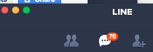

GGeditor
########

   This is the caption of the figure (a simple paragraph).

   The legend consists of all elements after the caption.  In this   case, the legend consists of this paragraph and the following   table:
   
   +-+-+
   |1|2|
   +-+-+
   |3|4|
   +-+-+

\ |IMG1|\ 

.. Attention::

   (content of attention)dkjfdfa
   
   kj

.. js:function:: $.getJSON(href, callback[, errback])
   :param string href: An URI to the location of the resource.
   :param callback: Gets called with the object.
   :param errback: Gets called in case the request fails. And a lot of other text so we 
   need multiple lines.
   :throws SomeError: For whatever reason in that case.
   :returns: Something.

   this is content

.. class::

   content of class

