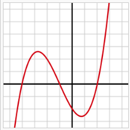

GGeditor
########

+-------------------+--------------------------------+---------------+
|header\*           |標題 x\ :sup:`2`\ +y\ :sub:`2`\ |\ `Search`_\   |
+===================+================================+===============+
|In mathematics,    |**In mathematics,**\            |In mathematics,|
+-------------------+--------------------------------+---------------+
|*In mathematics,*\ |   In mathematics,              |x \- 4x + 7    |
+-------------------+--------------------------------+---------------+

+----------------------------------------------------------------------------------------------------------------------------------------------------------------------------------------------------------------------------------------------------------------------------------------------------------------------------------------------------------------------------------------------------------------+------------------------------------------------------------------------------------------------------------------------------------------------------------------------------------------------------------------------------------------------------------------------------------------------------------------------------------------------------------------------------------------------------------------+
|indeterminate x is x − 4x + 7.                                                                                                                                                                                                                                                                                                                                                                                  |**標題 x**\ \ :sup:`2`\ **+y**\ \ :sub:`2`\                                                                                                                                                                                                                                                                                                                                                                       |
+----------------------------------------------------------------------------------------------------------------------------------------------------------------------------------------------------------------------------------------------------------------------------------------------------------------------------------------------------------------------------------------------------------------+------------------------------------------------------------------------------------------------------------------------------------------------------------------------------------------------------------------------------------------------------------------------------------------------------------------------------------------------------------------------------------------------------------------+
|In mathe♞matics,                                                                                                                                                                                                                                                                                                                                                                                                |**In mathematics,**\                                                                                                                                                                                                                                                                                                                                                                                              |
+----------------------------------------------------------------------------------------------------------------------------------------------------------------------------------------------------------------------------------------------------------------------------------------------------------------------------------------------------------------------------------------------------------------+------------------------------------------------------------------------------------------------------------------------------------------------------------------------------------------------------------------------------------------------------------------------------------------------------------------------------------------------------------------------------------------------------------------+
|In mathe♞matics,數學                                                                                                                                                                                                                                                                                                                                                                                            |   In mathematics,                                                                                                                                                                                                                                                                                                                                                                                                |
+----------------------------------------------------------------------------------------------------------------------------------------------------------------------------------------------------------------------------------------------------------------------------------------------------------------------------------------------------------------------------------------------------------------+------------------------------------------------------------------------------------------------------------------------------------------------------------------------------------------------------------------------------------------------------------------------------------------------------------------------------------------------------------------------------------------------------------------+
|*In mathematics*\ , \ |IMG1|\  a **polynomial**\ \ [#F1]_\  is an \ `expression`_\  consisting of \ `variables`_\  (or \ `indeterminates`_\ ) and \ `coefficients`_\ , that involves only the operations of \ `addition`_\ , \ `subtraction`_\ , \ `multiplication`_\ , and non\-negative \ `integer`_\  \ `exponents`_\ . An example of a polynomial of a single indeterminate x is x\ :sup:`2`\  − 4x + 7. An |* *In mathematics*\ , \ |IMG2|\  a **polynomial**\ \ [#F2]_\  is an \ `expression`_\  consisting of \ `variables`_\  (or \ `indeterminates`_\ ) and \ `coefficients`_\ , that involves only the operations of \ `addition`_\ , \ `subtraction`_\ , \ `multiplication`_\ , and non\-negative \ `integer`_\  \ `exponents`_\ . An example of a polynomial of a single indeterminate x is x\ :sup:`2`\  − 4x + 7. An |
+----------------------------------------------------------------------------------------------------------------------------------------------------------------------------------------------------------------------------------------------------------------------------------------------------------------------------------------------------------------------------------------------------------------+------------------------------------------------------------------------------------------------------------------------------------------------------------------------------------------------------------------------------------------------------------------------------------------------------------------------------------------------------------------------------------------------------------------+

.. _`Search`: http://www.google.com
.. _`expression`: https://en.wikipedia.org/wiki/Expression_(mathematics)
.. _`variables`: https://en.wikipedia.org/wiki/Variable_(mathematics)
.. _`indeterminates`: https://en.wikipedia.org/wiki/Indeterminate_(variable)
.. _`coefficients`: https://en.wikipedia.org/wiki/Coefficient
.. _`addition`: https://en.wikipedia.org/wiki/Addition
.. _`subtraction`: https://en.wikipedia.org/wiki/Subtraction
.. _`multiplication`: https://en.wikipedia.org/wiki/Multiplication
.. _`integer`: https://en.wikipedia.org/wiki/Integer
.. _`exponents`: https://en.wikipedia.org/wiki/Exponentiation

.. rubric:: Footnotes

.. [#f1]  Polynomial is poly+nomial
.. [#f2]  Polynomial is poly+nomial

.. |IMG2| image:: develop_test/img_2.png
   :height: 73 px
   :width: 73 px
   :target: http://www.google.com
