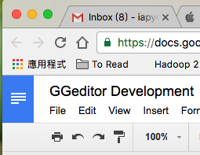

.. _h6a486b4240423657f1f2b16423f36:

GGEditor Development
********************

* \ |LINK1|\  to the GGeditor’s documentation in the readthedocs.org
* \ |LINK2|\  to the GGeditor’s repository in the Github
* \ |LINK3|\  to the ``User Guide``

+------------+--------------------------------------+
|\ |STYLE0|\ |\ |STYLE1|\                           |
+============+======================================+
|No prefix   |                                      |
+------------+--------------------------------------+
|#           |Pyth\*on                              |
+------------+--------------------------------------+
|\*          |Javascript, C++, \*\* Java \*\*, … etc|
+------------+--------------------------------------+
|//          |Javascript, C++, Java, ... etc        |
+------------+--------------------------------------+
|Ask         |whatever you say                      |
+------------+--------------------------------------+

+---------------------------+-----------------------+
|\ |STYLE2|\                |\ |STYLE3|\            |
+===========================+=======================+
|A \`single back-quote\`    |A `single back-quote`  |
+---------------------------+-----------------------+
|A \|replacement\| markup   |A |replacement2| markup|
+---------------------------+-----------------------+
|A \`\`double back-quote\`\`|A ``double back-quote``|
+---------------------------+-----------------------+
|A \|replacement\| markup   |A |replacement| markup |
+---------------------------+-----------------------+
|A \|replacement\| markup   |A |replacement2| markup|
+---------------------------+-----------------------+

.. |replacement| replace::   **replaced**

.. |replacement2| replace::   **replaced2**

.. name:: argument
    :option: value
    :option: value

    content

.. code:: 

    

.. code-block:: python
    :linenos:

    

.. toctree:: 
    :maxdepth: 2
    :hidden:

    (content of code)

.. _h63c7227b562f5f1a54714740535836:

para1
*****

* \ |LINK4|\  to the GGeditor’s documentation in the readthedocs.org
* \ |LINK5|\  to the GGeditor’s repository in the Github
* \ |LINK6|\  to the User Guide
* \ |IMG1|\ 
* \ |IMG2|\ 

+-+-+-+
|a|b|c|
+-+-+-+
|f|d|d|
+-+-+-+

\ |IMG3|\ 

.. code-block:: python
    :linenos:

    +---------+---------+
    |標題列   |標題列   |
    +=========+=========+
    |HELLO    |WORLD    |
    +---------+---------+

\ |IMG4|\ 

.. |STYLE0| replace:: **Options**

.. |STYLE1| replace:: **Note**

.. |STYLE2| replace:: **In Google Docs document**

.. |STYLE3| replace:: **Rendered in HTML page**

.. |LINK1| raw:: html

    <a href="http://ggeditor.readthedocs.io/en/latest/index.html" target="_blank">Link</a>

.. |LINK2| raw:: html

    <a href="https://github.com/iapyeh/GGeditor" target="_blank">Link</a>

.. |LINK3| raw:: html

    <a href="https://docs.google.com/document/d/1D2Q53jiQyOoSoqsNhTQuoRb1d2XlIJURgPz2OqrX0DE/edit?usp=sharing" target="_blank">Link</a>

.. |LINK4| raw:: html

    <a href="http://ggeditor.readthedocs.io/en/latest/index.html" target="_blank">Link</a>

.. |LINK5| raw:: html

    <a href="https://github.com/iapyeh/GGeditor" target="_blank">Link</a>

.. |LINK6| raw:: html

    <a href="https://docs.google.com/document/d/1D2Q53jiQyOoSoqsNhTQuoRb1d2XlIJURgPz2OqrX0DE/edit?usp=sharing" target="_blank">Link</a>

.. |IMG1| image:: static/develop_test_1.png
   :height: 125 px
   :width: 264 px
   :target: http://www.google.com

.. |IMG2| image:: static/develop_test_1.png
   :height: 36 px
   :width: 77 px

