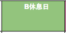

.. _h1e1675c5cb7b6425575741127962:

HTML TABDE convertion
######################

.. _h365645603e234c6a6a291b1b7e1d534:

Background, Foreground and links
================================

|REPLACE1|

|REPLACE2|

.. _bookmark-kix-q74pjka91gr0:

col and row span

|REPLACE3|

.. bottom of content

.. |REPLACE1| raw:: html

    <table cellspacing="0" cellpadding="0" style="width:75%">
    <tbody>
    <tr><td style="width:67%;background-color:#000000;vertical-align:Center">
words in red bigger font size
</td><td style="width:33%;color:#0000ff;vertical-align:Top">
words in blue
</td></tr>
    <tr><td style="background-color:#000000;color:#ff0000;vertical-align:Center">
</td><td style="color:#0000ff;vertical-align:Top">
</td></tr>
    <tr><td style="vertical-align:Top"><ol style="list-style:decimal;list-style-image:inherit;padding:0px 40px;margin:initial"><li style="list-style:inherit;list-style-image:inherit">external <a href="http://www.google.com" target="_blank">google</a> </li><li style="list-style:inherit;list-style-image:inherit">bookmark <a href="#bookmark-kix-q74pjka91gr0">link</a> </li><li style="list-style:inherit;list-style-image:inherit">cross-reference <a href="Examples.html">Examples</a> </li><li style="list-style:inherit;list-style-image:inherit">italic text</li><li style="list-style:inherit;list-style-image:inherit">normal text</li></ol></td><td style="background-color:#00ff00;vertical-align:Top">
green background with content of italic, bold and 有中文內容及上下標x2+y2+Tab
</td></tr>
    <tr><td style="background-color:#000000;vertical-align:Center">
Not supported: changing font-size and color 
</td><td style="vertical-align:Top">
 blue text with <a href="http://www.google.com" target="_blank">link</a> to google 
</td></tr>
    </tbody></table>

.. |REPLACE2| raw:: html

    <table cellspacing="0" cellpadding="0" style="width:100%">
    <tbody>
    <tr><td style="background-color:#000000;color:#ffffff;vertical-align:Top;border:solid 3px #0000ff">
A
</td><td style="background-color:#ff0000;color:#333333;vertical-align:Top;border:solid 3px #0000ff">
B
</td></tr>
    <tr><td style="background-color:#ffff00;color:#333333;vertical-align:Top;border:solid 3px #0000ff">
this is a list
<ol style="list-style:decimal;list-style-image:inherit;padding:0px 40px;margin:initial"><li style="list-style:inherit;list-style-image:inherit">this is 1</li><li style="list-style:inherit;list-style-image:inherit">this is 2</li><li style="list-style:inherit;list-style-image:inherit">this is 3</li></ol>
this is image in cell

</td><td style="background-color:#00ff00;vertical-align:Top;border:solid 3px #0000ff">
this is a list
<ul style="list-style:disc;list-style-image:inherit;padding:0px 40px;margin:initial"><li style="list-style:inherit;list-style-image:inherit">this is item with image</li><li style="list-style:inherit;list-style-image:inherit">this is item in red</li><li style="list-style:inherit;list-style-image:inherit">this is italic item<a href="http://www.google.com" target="_blank"> link to google</a></li><li style="list-style:inherit;list-style-image:inherit">this is bold item link to Example.html</li></ul></td></tr>
    </tbody></table>

.. |REPLACE3| raw:: html

    <table cellspacing="0" cellpadding="0" style="width:85%">
    <thead>
    <tr><th style="text-align:center;width:16%;background-color:#666666;vertical-align:Top;border:solid 1px #000000">
加班類型代碼
</th><th style="text-align:center;width:21%;background-color:#f3f3f3;color:#333333;vertical-align:Top;border:solid 1px #000000">
A工作日
</th><th style="text-align:center;width:21%;background-color:#93c47d;vertical-align:Top;border:solid 1px #000000">
B休息日
</th><th style="text-align:center;width:21%;background-color:#c27ba0;vertical-align:Top;border:solid 1px #000000">
C例假日
</th><th style="text-align:center;width:21%;background-color:#6d9eeb;vertical-align:Top;border:solid 1px #000000">
D休假日
</th></tr>
    </thead><tbody>
    <tr><td style="vertical-align:Bottom;border:solid 1px #000000">
</td><td style="vertical-align:Bottom;border:solid 1px #000000">
</td><td style="vertical-align:Top;border:solid 1px #000000">
每七日應有一日；哪一日（週六或週日）無規定，由公司自己決定
</td><td style="vertical-align:Top;border:solid 1px #000000">
每七日應有一日；哪一日（週六或週日）無規定，由公司自己決定
</td><td style="vertical-align:Top;border:solid 1px #000000">
特休、紀念日、勞動節等國定假日及其他（如選舉日）
</td></tr>
    <tr><td colspan="5" style="background-color:#ffff00;vertical-align:Top;border:solid 1px #000000">
前八小時名稱（本計算機的用法）

工作日加班

休息日工作

例假日工作

休假日工作
</td></tr>
    <tr><td style="vertical-align:Top;border:solid 1px #000000">
上班條件
</td><td style="vertical-align:Bottom;border:solid 1px #000000">
</td><td style="vertical-align:Top;border:solid 1px #000000">
勞工同意加班
</td><td style="vertical-align:Top;border:solid 1px #000000">
只有「天災、事變、突發事件」可要求勞工停休上班
</td><td style="vertical-align:Top;border:solid 1px #000000">
勞工同意加班
</td></tr>
    <tr><td style="vertical-align:Top;border:solid 1px #000000">
後八小時名稱（本計算機的用法）
</td><td style="vertical-align:Top;border:solid 1px #000000">
工作日加班
</td><td style="vertical-align:Top;border:solid 1px #000000">
休息日加班
</td><td rowspan="2" colspan="2" style="background-color:#4a86e8;color:#ffffff;vertical-align:Top;border:solid 1px #000000">
例假日加班

休假日加班

只要工作就算八小時

只要工作就算八小時
</td></tr>
    <tr><td style="vertical-align:Top;border:solid 1px #000000">
當日額外工資
</td><td style="vertical-align:Top;border:solid 1px #000000">
無；因月薪已包含
</td><td style="vertical-align:Top;border:solid 1px #000000">
前兩小時一又三分之一工作日時薪、後六小時一又三分之二工作日時薪;不滿四小時算四小時;不滿八小時算八小時
</td></tr>
    <tr><td style="vertical-align:Top;border:solid 1px #000000">
當日加班費（超過八小時之後）
</td><td rowspan="3" style="background-color:#00ff00;vertical-align:Top;border:solid 1px #000000">
前兩小時一又三分之一時薪、後兩小時一又三分之二時薪

可調整，請見使用說明文件

不必
</td><td style="vertical-align:Top;border:solid 1px #000000">
時薪為1又三分之二工作日時薪
</td><td rowspan="3" style="background-color:#ff0000;vertical-align:Top;border:solid 1px #000000">
每小時兩倍時薪

可調整，請見使用說明文件

要
</td><td style="vertical-align:Top;border:solid 1px #000000">
與平常日相同
</td></tr>
    <tr><td style="vertical-align:Top;border:solid 1px #000000">
最小單位
</td><td style="vertical-align:Top;border:solid 1px #000000">
不滿四小時算四小時（即超過八小時算十二小時）
</td><td style="vertical-align:Top;border:solid 1px #000000">
可調整，請見使用說明文件
</td></tr>
    <tr><td rowspan="2" style="background-color:#4a86e8;color:#ffffff;vertical-align:Top;border:solid 1px #000000">
補休

 計入每月加班限額46小時內 
</td><td style="vertical-align:Top;border:solid 1px #000000">
不必
</td><td style="vertical-align:Top;border:solid 1px #000000">
不必
</td></tr>
    <tr><td style="vertical-align:Top;border:solid 1px #000000">
當日超過八小時的部分
</td><td rowspan="2" colspan="2" style="text-align:center;background-color:#00ff00;vertical-align:Center;border:solid 1px #000000">
當日x2+y2+Tab都須計入

當日超過八小時的部分
</td><td style="vertical-align:Top;border:solid 1px #000000">
當日超過八小時的部分
</td></tr>
    <tr><td style="vertical-align:Bottom;border:solid 1px #000000">
</td><td style="vertical-align:Bottom;border:solid 1px #000000">
</td><td style="vertical-align:Bottom;border:solid 1px #000000">
</td></tr>
    <tr><td style="vertical-align:Top;border:solid 1px #000000">
其他計算規則一
</td><td colspan="4" style="vertical-align:Bottom;border:solid 1px #000000">
計算薪資時，同一天有兩種性質時，採取例假日（C）或 休息日（B）> 休假日（D）> 工作日（A）的原則
</td></tr>
    <tr><td style="vertical-align:Top;border:solid 1px #000000">
其他計算規則二
</td><td colspan="4" style="vertical-align:Top;border:solid 1px #000000">
一般工作日不足八小時的部分，本計算機不倒扣，依貴公司依據公司規定自行計算
</td></tr>
    <tr><td colspan="5" style="background-color:#ffff00;vertical-align:Bottom;border:solid 1px #000000">
蒐集完整蒐集這張規則表並不容易，主要原因是資料之間用語模糊與衝突的情況不少，必須詳細推敲求證，我們並沒有十足的把握，這張表都是正確的。歡迎您指正。我們若有訂正，會更新計算公式發行新版。
</td></tr>
    </tbody></table>

