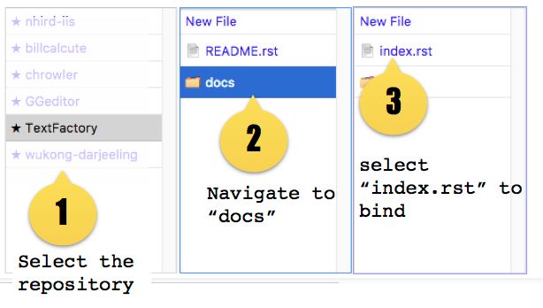
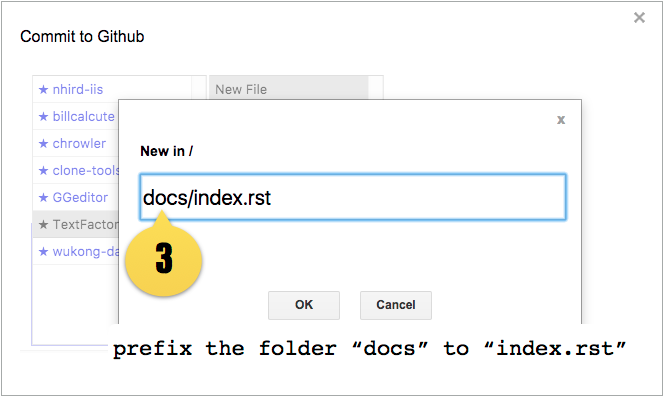
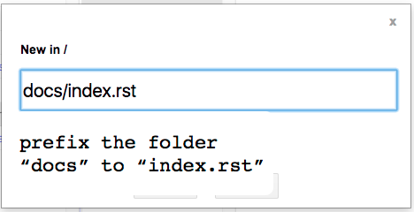
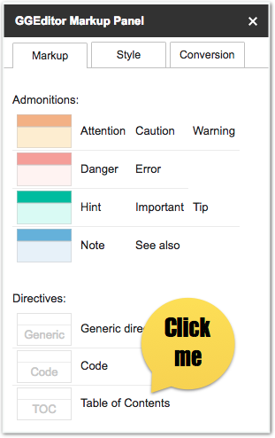
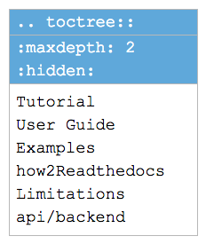
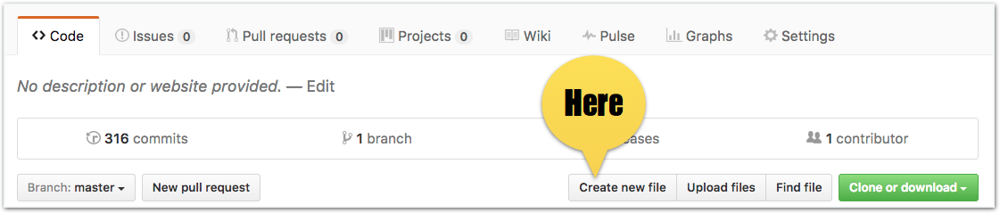
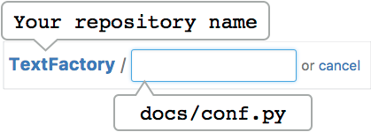
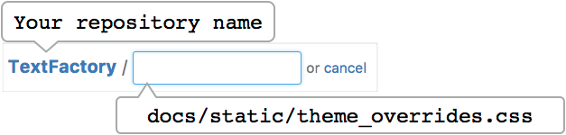

.. _h31232e4764c5e5a6a673749697b8027:

How to the Readthedocs
**********************

The \ |LINK1|\  (RTD) is an awesom place to host your documentation of projects in the Github as well as other repositories.

This is a simple guideline to help the GGeditor users to set up a basic project of the RTD. I have no idea if this is the best practice, it just works for me.

#. Create a Google Docs document and bind it to the “docs/index.rst” in the Github repository.
#. Insert markups of “toctree” table into index.rst.
#. Create "docs/conf.py" on Github
#. Create "docs/static/theme_overrides.css” on Github

That’s all. With the above 4 steps, you can go the RTD and create a project for your repository.

Below, I will show you how to do these steps with the GGeditor.

.. _h467c3456c435f3c292f45222c3d4910:

Step 1: Binding to the docs/index.rst
=====================================

You can bind the Google Docs document with the GGeditor by menu item “Add-ons/GGeditor/Commit to Github”. Then select your repository, docs folder and the index.rst file in the dialog.

If the “index.rst” file does not exist in your Github repository, you can navigate to the “docs” folder, then click “New File” and input “index.rst”. The GGeditor will create it.

\ |IMG1|\ 

 Or select “New File” to create.

\ |IMG2|\ 

If even the “docs” folder does not exist yet in your Github repository, you can input “docs/index.rst” as the name in the dialog of the “New File”. Like this:

\ |IMG3|\ 

.. _h195ff4c157e501d115f391d4e173b36:

Step 2: insert toctree markup to the index.rst
==============================================

The index.rst is the homepage of your project in the RTD. You can put anything you want. But you should not miss the awesome feature - the sidebar of “table of contents” for your documentation. Just simply do this in the GGeditor markup panel:

#. Insert a “Table of Contents” from the “GGeditor Markup Panel / Markup / Directives”

\ |IMG4|\ 

Then, the document would have a “toctree” table like this:

\ |IMG5|\ 

You can reference \ |LINK2|\  for example.

.. _h7f1657c7763721b311b652230436640:

Step 3: conf.py
===============

The Github allows user to create a new file in the repository page:

\ |IMG6|\ 

Then input the path and file name for your new file (docs/conf.py).

\ |IMG7|\ 

Below is the content for you to copy and paste.

.. code-block:: python
    :linenos:

    # -\*- coding: utf-8 -\*-
    
    from __future__ import unicode_literals
    import sys, os
    
    on_rtd = os.environ.get('READTHEDOCS', None) == 'True'
    
    sys.path.append(os.path.abspath(os.pardir))
    
    __version__ = '1.0'
    
    # -- General configuration -----------------------------------------------------
    
    source_suffix = '.rst'
    master_doc = 'index'
    project = 'CHANGE-THIS'
    copyright = '2016, CHANGE-THIS'
    
    # The name of the Pygments (syntax highlighting) style to use.
    pygments_style = 'sphinx'
    
    extlinks = {}
    
    # -- Options for HTML output ---------------------------------------------------
    
    html_theme = 'default'
    
    html_static_path = ['static']
    
    def setup(app):
        # overrides for wide tables in RTD theme
        app.add_stylesheet('theme_overrides.css') # path relative to static
    
    """
      You might want to uncomment the “latex_documents = []” if you use CKJ characters in your document.
      Because the pdflatex raises exception when generate Latex documents with CKJ characters.  
    """
    #latex_documents = []

.. Tip:: 

    To utilize the full power of the Sphinx, you can consult \ |LINK3|\ .

.. _h4a47434f5c5745347cc5f1b4d2d5023:

Step 4: theme_overrides.css
===========================

You can use the same way to create a new “theme_overrides.css” in the “docs/static” folder. Like this:

\ |IMG8|\ 

Below is the content of the theme_overrides.css for you to copy and paste.

.. code:: 

    .wy-table-responsive table td, .wy-table-responsive table th {
       white-space: inherit;
    }

Because the standard theme set the white-space to be “no-wrap” for table cell undesirable for the converted table of the GGeditor.

.. |LINK1| raw:: html

    <a href="https://readthedocs.org" target="_blank">readthedocs.org</a>

.. |LINK2| raw:: html

    <a href="https://docs.google.com/document/d/13b5dr8TZoTC5IJZeoiDt066b6mwq67yHqcl4TYUFnk0/edit?usp=sharing" target="_blank">the index.rst of the GGeditor</a>

.. |LINK3| raw:: html

    <a href="http://www.sphinx-doc.org/en/1.4.8/config.html#options-for-html-output" target="_blank">this document</a>

