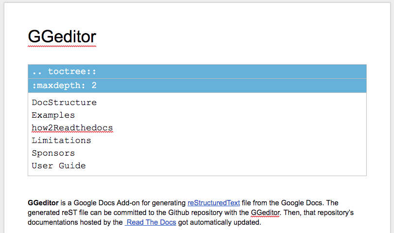

.. _h7f551d34286643173b507b745668a4f:

How-to the Readthedocs
######################

This is a simple guideline to help GGeditor users to setup a basic project of the \ `readthedocs.org`_\ . I have no idea if this is the best practice, it just works for me.

#. You got to have a conf.py in the “docs” folder.
#. You got to have a theme_overrides.css in the “static” folder.
#. You got to have a index.rst in the “docs” folder and it contains a “toctree” markups in the index.rst.

That’s all. With the above 3 steps, you can create a project in the readthedocs.org and enjoy it. Well, be more details:

.. _h5dd7fe7f33697b5d497914774677:

conf.py
*******

Below is the context for you to copy and paste.

.. code:: python

    # -*- coding: utf-8 -*-
    
    from __future__ import unicode_literals
    import sys, os
    
    on_rtd = os.environ.get('READTHEDOCS', None) == 'True'
    
    sys.path.append(os.path.abspath(os.pardir))
    
    __version__ = '1.0'
    
    # -- General configuration -----------------------------------------------------
    source_suffix = '.rst'
    master_doc = 'index'
    project = 'CHANGE-THIS'
    copyright = '2016, CHANGE-THIS'
    # The name of the Pygments (syntax highlighting) style to use.
    pygments_style = 'sphinx'
    
    extlinks = {}
    
    # -- Options for HTML output ---------------------------------------------------
    
    html_theme = 'default'
    
    html_static_path = ['static']
    
    def setup(app):
        # overrides for wide tables in RTD theme
        app.add_stylesheet('theme_overrides.css') # path relative to static

.. _h2e314c3b23771ce592cd877506c4e:

Theme_overrides.css
*******************

Below is the context for you to copy and paste.

.. code:: 

    .wy-table-responsive table td, .wy-table-responsive table th {
       white-space: inherit;
    }

Because the standard theme set the white-space to be “no-wrap” for table cell. Which is not desirable for the converted table of the GGeditor.

.. Note:: 

    Github has tool which can create plain text file (such as conf.py and Theme_overrides.css) very easily.

.. _h222539617c7a7255301a60406d156810:

Index.rst
*********

This is the homepage of a project in the readthedocs.org. You can put anything you want. But you should not miss the awesome feature - the sidebar of “table of contents”. What you got to enjoy this is simple:

#. Create a Google Docs document and bind it to “docs/index.rst” in your Github project.
#. Insert a “Table of Contents” from the “GGeditor Markup Panel / Markup / Directives”

\ |IMG1|\ 

Then, the document would have a “toctree” table like this:

\ |IMG2|\ 

You can reference \ `the index.rst of the GGeditor`_\  for example.

.. _`readthedocs.org`: https://readthedocs.org
.. _`the index.rst of the GGeditor`: https://docs.google.com/document/d/13b5dr8TZoTC5IJZeoiDt066b6mwq67yHqcl4TYUFnk0/edit?usp=sharing

.. |IMG1| image:: how2Readthedocs/how2Readthedocs_1.png
   :height: 493 px
   :width: 310 px

