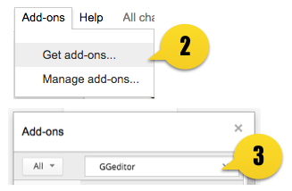

.. _h28105e656d4d48041184d771d3b4a1a:

GGeditor
########

.. toctree::
    :maxdepth: 2

    DocStructure
    Examples
    Sponsors

\ **GGeditor**\  is a Google Docs Add\-on for generating \ `reStructuredText`_\  file from the Google Docs. then, the generated reST file can be directly committed to the Github repository with the GGeditor. And then, the project in the \ `Read The Docs`_\  will be automatically updated.

\ |IMG1|\ 

.. _h2a295c550356a4d13352852183e3e9:

Features:
*********

#. Easy start for reST beginners.
#. Powered by the Google Docs. Almost what you see is what you get.
#. One\-click to commit to the Github repository.
#. Preview the generated reST file.
#. Support headings, bold, italic, hyperlink, subscript and superscript.
#. Support footnotes, image, list item and table.
#. Support full\-width characters (CKJ) content in table.
#. Support internal links to bookmarks, headings and table of content.
#. Support sphinx\-style table of content (.. doctree::).
#. Support sphinx\-style admonitions.

.. _h131f586a50795a4822677d4166231766:

How to install
**************

#. Open a Google Docs document.
#. On the menu item “Add\-ons”, click the “Get Add\-ons”
#. In the search box, input “GGeditor”

\ |IMG2|\ 

Related Works

* \ `Gitbook`_\ : it has a markup editor
* \ `Online reStructuredText editor`_\ 

.. _`reStructuredText`: https://en.wikipedia.org/wiki/ReStructuredText
.. _`Read The Docs`: https://readthedocs.org/
.. _`Gitbook`: https://www.gitbook.com
.. _`Online reStructuredText editor`: http://rst.ninjs.org/

.. |IMG1| image:: index/index_1.png
   :height: 250 px
   :width: 504 px

