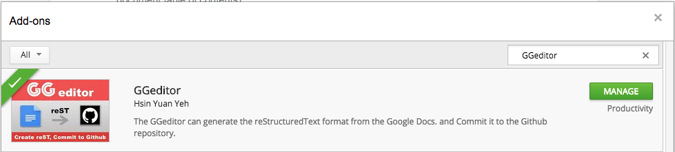

.. toctree:: 
    :maxdepth: 2
    :hidden:

    Tutorial
    User Guide
    Examples
    how2Readthedocs
    ApiDoc
    Limitations
    api/backend

.. admonition:: Announcements - 2020

    * [Apr 19] \ |LINK1|\ 

.. admonition:: Announcements - 2017

    * [Jan 29] \ |LINK2|\ 
    
    * [Jan 22] \ |LINK3|\ ).
    
    * [Jan 15] New Release for multiple accounts and conversion with HTML-table.

.. _h28105e656d4d48041184d771d3b4a1a:

GGeditor
********

\ |IMG1|\  \ |LINK4|\ 

GGeditor hopes to help you to focus on writing your idea instead of marking them up.

\ |STYLE0|\  is a Google Docs Add-on for generating \ |LINK5|\  file from the Google Docs. The generated reST file can be committed to the Github repository with the GGeditor. Then, that repository’s documentations hosted by the  \ |LINK6|\  (RTD) got automatically updated.

\ |IMG2|\ 

..  Note:: 

    You don’t need to trigger conversion before committing and downloading, the committing and downloading would do conversion internally at first.

.. _h6897050511836763421463e2b4b685:

Features
========

#. Easy starting for reST beginners, even no idea about reST markups.

#. Powered by the Google Docs. Almost what you see is what you get. As well as the coordination of team works.

#. One-click to commit to the Github repository.

#. Preview the generated reST file and download to local machine.

#. Support headings, bold, italic, hyperlink, subscript and superscript.

#. Support footnotes, image, list item and table.

#. Support full-width characters (CKJ) in headings and table.

#. Support internal links to bookmarks, headings and Google Docs native table of contents (in document table of contents).

#. Support relative links to other generated reST files of the Google Docs under the same folder and subfolders.

#. Support cross-document table of content (.. toctree::) for the RTD.

#. Support all style of admonitions of the RTD.

#. Support multiple accounts for committing to repositories in different accounts.

#. Support converting table with HTML tags to let look-and-feel as the same as possible for blogers.

.. _h131f586a50795a4822677d4166231766:

How to install
==============

\ |LINK7|\ , or in a Google Docs Document:

#. On the menu item “Add-ons”, click the “Get Add-ons”

#. In the search box, input “GGeditor”, then click on the GGeditor icon to install.

\ |IMG3|\ 

.. _h177537546887b67276822514c66016:

How to Use
==========

Please refer to this article \ |LINK8|\ 

.. _h84e3b4616757118376d336e2e5d5d23:

For reStructuredText Beginners
==============================

If you are a beginner of the reStructuredText and you feel a little bit of confusing about how to put your documents onto the RTD website. I wrote two quick guides to help your task to be quickly completed with the GGeditor. 

\ |LINK9|\ 

    This guide for you to make the 1st copy of your product documents get online.

\ |LINK10|\ 

    This guide for you to make the 1st copy of your module documents get online.

I was struggling on writing reStructuredText for a long time . Now, with the GGeditor and these two tutorials, I hope them can help you to get jobs done quicker and easier.

.. _h7c12a2e595c631221f363d4e55c21:

Acknowledgments
===============

* Andrey Rublev as well as \ |LINK11|\  of the \ |LINK12|\ , it is a great tool for beginner to learn the reST markups.

* Bitwiseshiftleft as well as \ |LINK13|\  of the \ |LINK14|\  projects. The sjcl.js is used for credentials encryption.

* \ |LINK15|\ . Hard to be briefly described. In short, its excellent AR series let me have time to work on this project.

* Philip Schatz as well as \ |LINK16|\  of the  \ |LINK17|\  project. The Github-related implementation is on this wonderful tool.

* \ |LINK18|\  as well as \ |LINK19|\ . Pelican lead me to the world of markup. The conf.py is borrowed from the pelican’s repository.

* \ |LINK20|\  (RTD), it provides a great service, which encourage me to create the GGeditor.

.. _h5d303e73368631b6320494219743f2d:

Release Notes
=============

.. admonition:: Jan 15, 2017

    New:
    
    #. Convert table in HTML tags for preserving background color, column-span, row-span and column width.
    
    #. Multiple github accounts
    
    Improved:
    
    #. New "Settings" panel for accounts and document options.
    
    #. In partial conversion, markups of table will keep the same as it is in whole document conversion.
    

.. admonition:: Dec 27, 2016

    Improved:
    
    * Create new file in github failed if the new path has new folder great than 1 level, ex, create docs/blog/technical/how2pythondocs.py in docs/ where blog/technical is not existed yet.
    
    * For In-document TOC, there is no extra empty line between items.
    
    * For partial convsion of selection or table, the conversion dialog would break a line for every 60 characters. It makes content easier to read.
    
    * For simplicity, the “Download” button is hidden in partial conversion except images are included.
    
    * Hyperlink in footnote content is allowed.
    
    * “Add link to another document” only displays items binding to the same repository with current document. And generated path is relative to current document.
    
    Fixed:
    
    * Insert link to another document failed for documents with binding file if the binding path is different document path.
    
    Featured:
    
    * Add directive of "custom admonition".
    
    * Add directive of "raw HTML"
    
    Limited:
    
    * Internal link to heading does not work. Currently there is no API to identifiy the target heading element. Please use “Bookmark“ instead.

.. _h2c1d74277104e41780968148427e:

.. admonition:: Dec 6, 2016

    New
    
    * Support partial conversion for selectd elements and table.
    
    * Same image used multiple times is now only one copy been uploaded.
    
    Improved
    
    * Conversion features has an individual dialog. (improvment)
    
    Fixed
    
    * Downloaded zip file now got file name from binding file. (bug fix)

.. _h4a6049483e752949322f585c69102a2a:

Appreciation for You
====================

It would really help us if you had a second to

* \ |LINK21|\ 

* Or \ |LINK22|\ 

that helps us keep momentun on GGeditor.

\ |LINK23|\ 

.. bottom of content

.. |STYLE0| replace:: **GGeditor**

.. |LINK1| raw:: html

    <a href="GithubBadCredentials.html">Github "Bad credentials" Issue and solution</a>

.. |LINK2| raw:: html

    <a href="https://youtu.be/PUswAbvpE7c" target="_blank">Tutorial - Create a project site in the RTD</a>

.. |LINK3| raw:: html

    <a href="https://goo.gl/qH1WWj" target="_blank">從零開始建立一個RTD文件網站(Mandarin</a>

.. |LINK4| raw:: html

    <a href="https://cirospat.readthedocs.io/it/latest/" target="_blank">Italian version  by Ciro Spataro</a>

.. |LINK5| raw:: html

    <a href="https://en.wikipedia.org/wiki/ReStructuredText" target="_blank">reStructuredText</a>

.. |LINK6| raw:: html

    <a href="https://readthedocs.org/" target="_blank">Readthedocs.org</a>

.. |LINK7| raw:: html

    <a href="https://chrome.google.com/webstore/detail/ggeditor/piedgdbcihbejidgkpabjhppneghbcnp" target="_blank">Click this link to the Google Docs Add-on page</a>

.. |LINK8| raw:: html

    <a href="User%20Guide.html">How to Use</a>

.. |LINK9| raw:: html

    <a href="how2Readthedocs.html">How to create a generic website of documentation on the RTD</a>

.. |LINK10| raw:: html

    <a href="ApiDoc.html">How to create API document for python modules</a>

.. |LINK11| raw:: html

    <a href="https://github.com/anru/rsted/graphs/contributors" target="_blank">all the contributors</a>

.. |LINK12| raw:: html

    <a href="http://rst.ninjs.org/" target="_blank">Online reStructuredText editor</a>

.. |LINK13| raw:: html

    <a href="https://github.com/bitwiseshiftleft/sjcl/graphs/contributors" target="_blank">all the contributors</a>

.. |LINK14| raw:: html

    <a href="https://github.com/bitwiseshiftleft/sjcl" target="_blank">sjcl</a>

.. |LINK15| raw:: html

    <a href="http://neusauber.com" target="_blank">Neusauber.com</a>

.. |LINK16| raw:: html

    <a href="https://github.com/philschatz/octokat.js/graphs/contributors" target="_blank">all the contributors</a>

.. |LINK17| raw:: html

    <a href="https://github.com/philschatz/octokat.js" target="_blank">octokat.js</a>

.. |LINK18| raw:: html

    <a href="https://github.com/getpelican/pelican" target="_blank">Pelican project</a>

.. |LINK19| raw:: html

    <a href="https://github.com/getpelican/pelican/graphs/contributors" target="_blank">all the contributes</a>

.. |LINK20| raw:: html

    <a href="https://readthedocs.org" target="_blank">Readthedocs.org</a>

.. |LINK21| raw:: html

    <a href="https://chrome.google.com/webstore/detail/ggeditor/piedgdbcihbejidgkpabjhppneghbcnp" target="_blank">Leave a Google Docs store rating</a>

.. |LINK22| raw:: html

    <a href="https://github.com/iapyeh/GGeditor" target="_blank">star GGeditor on Github</a>

.. |LINK23| raw:: html

    <a href="https://docs.google.com/document/d/13b5dr8TZoTC5IJZeoiDt066b6mwq67yHqcl4TYUFnk0/edit?usp=sharing" target="_blank">Source document in the Google Docs</a>

.. |IMG1| image:: static/index_1.png
   :height: 26 px
   :width: 41 px

.. |IMG2| image:: static/index_2.png
   :height: 250 px
   :width: 504 px

