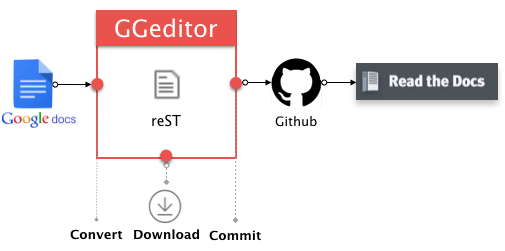

.. _h28105e656d4d48041184d771d3b4a1a:

GGeditor
########

.. toctree:: 
    :maxdepth: 2
    :hidden:

    Tutorial
    User Guide
    Examples
    how2Readthedocs
    Limitations

GGeditor hopes to help you to focus on writing your idea instead of marking them up.

\ |STYLE0|\  is a Google Docs Add-on for generating \ |LINK1|\  file from the Google Docs. The generated reST file can be committed to the Github repository with the GGeditor. Then, that repository’s documentations hosted by the \ |LINK2|\  got automatically updated.

\ |IMG1|\ 

.. Note:: 

    You don’t need to trigger conversion before committing and downloading, the committing and downloading would do conversion internally at first.

.. _h6897050511836763421463e2b4b685:

Features
********

#. Easy starting for reST beginners, even no idea about reST markups.
#. Powered by the Google Docs. Almost what you see is what you get. As well as the coordination of team works.
#. One-click to commit to the Github repository.
#. Preview the generated reST file and download to local machine.
#. Support headings, bold, italic, hyperlink, subscript and superscript.
#. Support footnotes, image, list item and table.
#. Support full-width characters (CKJ) in headings and table.
#. Support internal links to bookmarks, headings and Google Docs native table of contents (in document table of contents).
#. Support relative links to other generated reST files of the Google Docs under the same folder and subfolders.
#. Support cross-document table of content (.. toctree::) for the readthedocs.org.
#. Support all style of admonitions of the readthedocs.org.

.. _h131f586a50795a4822677d4166231766:

How to install
**************

\ |LINK3|\ , or in a Google Docs Document:

#. On the menu item “Add-ons”, click the “Get Add-ons”
#. In the search box, input “GGeditor”, then click on the GGeditor icon to install.

\ |IMG2|\ 

.. _h177537546887b67276822514c66016:

How to Use
**********

Please refer to this article \ |LINK4|\ 

.. _h11806048484a3a454a71736b276e3bb:

For  reStructuredText Beginners
*******************************

If you are a beginner of the reStructuredText and you feel a little bit of confusing about how to put your documents onto the readthedocs.org website. I wrote a quick guide to help your task to be quickly completed with the GGeditor. I was struggling on the reST for 2 months . Now with the GGeditor and this tutorial, you might get it done in several hours, I hope.

\ |LINK5|\ 

.. _h7c12a2e595c631221f363d4e55c21:

Acknowledgments
***************

* Andrey Rublev as well as \ |LINK6|\  of the \ |LINK7|\ , it is a great tool for beginner to learn the reST markups.
* Bitwiseshiftleft as well as \ |LINK8|\  of the \ |LINK9|\  projects. The sjcl.js is used for credentials encryption.
* \ |LINK10|\ . Hard to be briefly described. In short, its excellent AR series let me have time to work on this project.
* Philip Schatz as well as \ |LINK11|\  of the  \ |LINK12|\  project. The Github-related implementation is on this wonderful tool.
* \ |LINK13|\  as well as \ |LINK14|\ . Pelican lead me to the world of markup. The conf.py is borrowed from the pelican’s repository.
* \ |LINK15|\ , it provides a great service, which encourage me to create the GGeditor.

\ |LINK16|\ 

.. |STYLE0| replace:: **GGeditor**

.. |LINK1| raw:: html

    <a href="https://en.wikipedia.org/wiki/ReStructuredText" target="_blank">reStructuredText</a>

.. |LINK2| raw:: html

    <a href="https://readthedocs.org/" target="_blank">Read The Docs</a>

.. |LINK3| raw:: html

    <a href="https://chrome.google.com/webstore/detail/ggeditor/piedgdbcihbejidgkpabjhppneghbcnp" target="_blank">Click this link to the Google Docs Add-on page</a>

.. |LINK4| raw:: html

    <a href="User%20Guide.html">How to Use</a>

.. |LINK5| raw:: html

    <a href="how2Readthedocs.html">Here is the quick guide for reStructuredText beginners.</a>

.. |LINK6| raw:: html

    <a href="https://github.com/anru/rsted/graphs/contributors" target="_blank">all the contributors</a>

.. |LINK7| raw:: html

    <a href="http://rst.ninjs.org/" target="_blank">Online reStructuredText editor</a>

.. |LINK8| raw:: html

    <a href="https://github.com/bitwiseshiftleft/sjcl/graphs/contributors" target="_blank">all the contributors</a>

.. |LINK9| raw:: html

    <a href="https://github.com/bitwiseshiftleft/sjcl" target="_blank">sjcl</a>

.. |LINK10| raw:: html

    <a href="http://neusauber.com" target="_blank">Neusauber.com</a>

.. |LINK11| raw:: html

    <a href="https://github.com/philschatz/octokat.js/graphs/contributors" target="_blank">all the contributors</a>

.. |LINK12| raw:: html

    <a href="https://github.com/philschatz/octokat.js" target="_blank">octokat.js</a>

.. |LINK13| raw:: html

    <a href="https://github.com/getpelican/pelican" target="_blank">Pelican project</a>

.. |LINK14| raw:: html

    <a href="https://github.com/getpelican/pelican/graphs/contributors" target="_blank">all the contributes</a>

.. |LINK15| raw:: html

    <a href="https://readthedocs.org" target="_blank">Readthedocs.org</a>

.. |LINK16| raw:: html

    <a href="https://docs.google.com/document/d/13b5dr8TZoTC5IJZeoiDt066b6mwq67yHqcl4TYUFnk0/edit?usp=sharing" target="_blank">Source document in the Google Docs</a>

