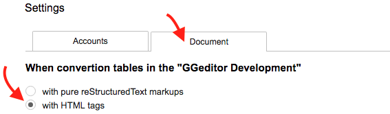

.. _h7417311651356b38234173e38352a34:

Table conversion with HTML
**************************

Table conversion to reStructuredText has limitation due to limited features were supported by the reStructuredText. For example, row-span, column-span and background color were not supported in reStructuredText.

This could be a problem for users who want to write their blogs in reStructuredText. The GGeditor solves this issue by converting a table to HTML-table instead of the reStructuredText-table.

.. _h5e3c71275653e247c4d305d12131433:

Supported Features
==================

* Columns width in propotion of percentage.

* Column span or row span.

* Cell background and foreground color.

* Table border and cell border.

* Cell-level font-size

.. _h23786b7a28397e315b4726412e52451:

Eenable this feature
====================

Converting table with HTML is not default behavior. To enable it, please open the Settings dialog to enable it.

\ |IMG1|\ 

.. _h17cf336a3119355a1c01f75426961:

Examples
========

.. _h365645603e234c6a6a291b1b7e1d534:

Background, Foreground and links
--------------------------------

|REPLACE1|

.. _hf5e23482d7d5f257f501e131f189d:

List items
----------

|REPLACE2|

.. _h2929565b25e3945d5f2b58e2a37:

List items 2
------------

|REPLACE3|

.. _bookmark-kix-q74pjka91gr0:

.. _h60543071b22465442566921864d10:

col and row span
----------------

|REPLACE4|

.. _h2c1d74277104e41780968148427e:

.. _h1a461f6b1275321a16291dd169a6c:

Limitations
===========

* Horizental alignment is not supported. Because of the Doc's API always returns null when getting this attribute value.(API issue)

* Constant font style (font-size, family) in a single cell.

* Vertial-alignment of cell content. (API issue)

* Cell height (API isue)

♞ \ |LINK1|\ 

.. bottom of content

.. |REPLACE1| raw:: html

    <table cellspacing="0" cellpadding="0" style="width:75%">
    <tbody>
    <tr><td style="width:67%;background-color:#ff9900;vertical-align:Center;border:solid 3px #4a86e8">
green background with content of italic, bold and 有中文內容及上下標 

x2+y2+Tab
</td><td style="width:33%;color:#0000ff;vertical-align:Top;border:solid 3px #4a86e8">
words in blue with font-family "Comic Sans MS"
</td></tr>
    </tbody></table>

.. |REPLACE2| raw:: html

    <table cellspacing="0" cellpadding="0" style="width:75%">
    <tbody>
    <tr><td style="width:67%;vertical-align:Top;border:solid 3px #ff0000"><ol style="list-style:decimal;list-style-image:inherit;padding:0px 40px;margin:initial"><li style="list-style:inherit;list-style-image:inherit">external <a href="http://www.google.com" target="_blank">google</a> </li><li style="list-style:inherit;list-style-image:inherit">bookmark <a href="#bookmark-kix-q74pjka91gr0">link</a> </li><li style="list-style:inherit;list-style-image:inherit">cross-reference <a href="Examples.html">Examples</a> </li><li style="list-style:inherit;list-style-image:inherit">italic text item</li><li style="list-style:inherit;list-style-image:inherit">bold text item</li><li style="list-style:inherit;list-style-image:inherit">this isitem with image</li></ol></td><td style="width:33%;background-color:#00ff00;vertical-align:Top;border:solid 3px #ff0000">
green background with content of italic, bold and 有中文內容及上下標x2+y2+Tab
</td></tr>
    </tbody></table>

.. |REPLACE3| raw:: html

    <table cellspacing="0" cellpadding="0" style="width:100%">
    <tbody>
    <tr><td style="background-color:#ffff00;vertical-align:Top;border:solid 3px #0000ff">
this is a list
<ol style="list-style:decimal;list-style-image:inherit;padding:0px 40px;margin:initial"><li style="list-style:inherit;list-style-image:inherit">this is 1</li><li style="list-style:inherit;list-style-image:inherit">this is 2</li><li style="list-style:inherit;list-style-image:inherit">this is 3</li></ol>
this has image in cell

</td><td style="background-color:#00ff00;vertical-align:Top;border:solid 3px #0000ff">
this is a list
<ul style="list-style:disc;list-style-image:inherit;padding:0px 40px;margin:initial"><li style="list-style:inherit;list-style-image:inherit">this is item with image</li><li style="list-style:inherit;list-style-image:inherit">this is item in red</li><li style="list-style:inherit;list-style-image:inherit">this is italic item<a href="http://www.google.com" target="_blank"> link to google</a></li><li style="list-style:inherit;list-style-image:inherit">this is bold item link to <a href="Examples.html">Example.html</a></li></ul></td></tr>
    </tbody></table>

.. |REPLACE4| raw:: html

    <table cellspacing="0" cellpadding="0" style="width:85%">
    <thead>
    <tr><th style="text-align:center;width:16%;background-color:#666666;color:#333333;vertical-align:Top;border:solid 1px #000000">
Header
</th><th style="text-align:center;width:21%;background-color:#f3f3f3;color:#333333;vertical-align:Top;border:solid 1px #000000">
Header
</th><th style="text-align:center;width:21%;background-color:#93c47d;color:#333333;vertical-align:Top;border:solid 1px #000000">
Header
</th><th style="text-align:center;width:21%;background-color:#c27ba0;color:#333333;vertical-align:Top;border:solid 1px #000000">
Header
</th><th style="text-align:center;width:21%;background-color:#6d9eeb;color:#333333;vertical-align:Top;border:solid 1px #000000">
Header
</th></tr>
    </thead><tbody>
    <tr><td style="vertical-align:Bottom;border:solid 1px #000000">
Text
</td><td style="vertical-align:Bottom;border:solid 1px #000000">
Text
</td><td style="vertical-align:Top;border:solid 1px #000000">
Text
</td><td style="vertical-align:Top;border:solid 1px #000000">
Text
</td><td style="vertical-align:Top;border:solid 1px #000000">
Text
</td></tr>
    <tr><td colspan="5" style="background-color:#ffff00;vertical-align:Top;border:solid 1px #000000">
Text
</td></tr>
    <tr><td style="vertical-align:Top;border:solid 1px #000000">
Text
</td><td style="vertical-align:Bottom;border:solid 1px #000000">
Text
</td><td style="vertical-align:Top;border:solid 1px #000000">
Text
</td><td style="vertical-align:Top;border:solid 1px #000000">
Text
</td><td style="vertical-align:Top;border:solid 1px #000000">
Text
</td></tr>
    <tr><td style="vertical-align:Top;border:solid 1px #000000">
Text
</td><td style="vertical-align:Top;border:solid 1px #000000">
Text
</td><td style="vertical-align:Top;border:solid 1px #000000">
Text
</td><td rowspan="2" colspan="2" style="background-color:#4a86e8;vertical-align:Top;border:solid 1px #000000">

</td></tr>
    <tr><td style="vertical-align:Top;border:solid 1px #000000">
Text
</td><td style="vertical-align:Top;border:solid 1px #000000">
Text
</td><td style="vertical-align:Top;border:solid 1px #000000">
Text
</td></tr>
    <tr><td style="vertical-align:Top;border:solid 1px #000000">
Text
</td><td rowspan="3" style="background-color:#00ff00;vertical-align:Top;border:solid 1px #000000">

</td><td style="vertical-align:Top;border:solid 1px #000000">
Text
</td><td rowspan="3" style="background-color:#ff0000;vertical-align:Top;border:solid 1px #000000">
Text
</td><td style="vertical-align:Top;border:solid 1px #000000">
Text
</td></tr>
    <tr><td style="vertical-align:Top;border:solid 1px #000000">
Text
</td><td style="vertical-align:Top;border:solid 1px #000000">
Text
</td><td style="vertical-align:Top;border:solid 1px #000000">
Text
</td></tr>
    <tr><td rowspan="2" style="background-color:#4a86e8;vertical-align:Top;border:solid 1px #000000">
Text
</td><td style="vertical-align:Top;border:solid 1px #000000">
Text
</td><td style="vertical-align:Top;border:solid 1px #000000">
Text
</td></tr>
    <tr><td style="vertical-align:Top;border:solid 1px #000000">
Text
</td><td rowspan="2" colspan="2" style="background-color:#00ff00;vertical-align:Center;border:solid 1px #000000">
Text and 
</td><td style="vertical-align:Top;border:solid 1px #000000">
Text
</td></tr>
    <tr><td style="vertical-align:Bottom;border:solid 1px #000000">
Text
</td><td style="vertical-align:Bottom;border:solid 1px #000000">
Text
</td><td style="vertical-align:Bottom;border:solid 1px #000000">
Text
</td></tr>
    <tr><td style="vertical-align:Top;border:solid 1px #000000">
Text
</td><td colspan="4" style="vertical-align:Top;border:solid 1px #000000">
Text
</td></tr>
    <tr><td colspan="5" style="background-color:#ffff00;vertical-align:Bottom;border:solid 1px #000000">
Text
</td></tr>
    </tbody></table>

.. |LINK1| raw:: html

    <a href="https://docs.google.com/document/d/1d-NgzTw418Ml3PgQPLoJaw76whgnUW2x1IUt8WjOrnI/edit?usp=sharing" target="_blank">Source document of this page</a>

