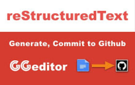
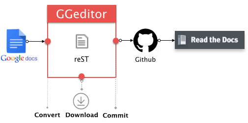
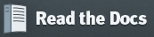
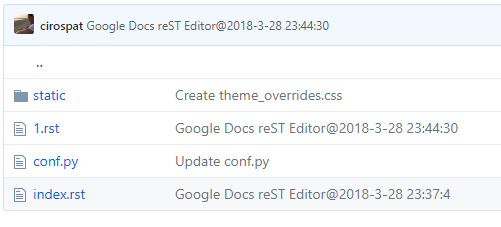

.. _h403f631c642863610673372f386278:

Da Google Doc a Read the Docs
*****************************

Questo documento rappresenta una via facile per migliorare la qualità dei documenti pubblicati sul web.

Oggi il formato PDF rappresenta il principale formato di testo per la pubblicazione di documenti sia da parte della Pubblica Amministrazione che dai soggetti privati.

Purtroppo il PDF è un formato che non si adatta ai display piccoli dei dispositivi mobili, ed oggi la fruizione dei contenuti del web è molto consistente sui dispositivi mobili. In più il formato PDF non consente un agevole e facile ricerca di parole all'interno del documento.

Queste due criticità lo rendono un formato ormai vetusto nel 2018, non più rispondente alle esigenze di fruibilità di contenuti documentali su display di dimensioni contenute (smartphone, tablet).

\ |LINK1|\  è un componente plug-in che si installa direttamente da Google Doc della suite di Google Drive. Google Drive (e i suoi servizi) oggi è molto usato anche nelle Pubbliche Amministrazioni, oltre che dai privati, per la facilità di condivisione dei documenti in gruppo.

.. admonition:: Importante

    Questa pagina che state leggendo deriva direttamente da \ |LINK2|\ 

|

\ |STYLE0|\  consente di compilare documenti sulla piattaforma di repository codice Github, che a sua volta serve per illustrare i documenti su Read the Docs in maniera gradevole, e strutturata per la fruizione dei contenuti indicizzati ad albero (capitoli, paragrafi, sotto- paragrafi).

.. _h3092c7d75e1f5a466f42767b37185:

GGeditor ed i file RST
======================

\ |IMG1|\ 

[il plug-in GGeditor installabile da Google Docs (cercalo nei "Componenti aggiuntivi")]

|

.. admonition:: GG editor

    \ |LINK3|\  é un plug-in di Google Docs che serve a generare file \ |STYLE1|\  (\ |LINK4|\ ) direttamente da Google Docs. Il file RST generato può essere compilato nel repository di Github direttamente dall'editor GG. La documentazione così creata su Google Docs può essere ospitata da \ |LINK5|\  venendo aggiornata automaticamente ad ogni aggiornamento del Google Docs

|

.. _h326df60552448603d593767751d0d:

Video tutorial di funzionamento di GGeditor
===========================================

|REPLACE1|

|

.. _h5d92650581a8042635e3d4b2ef7d7d:

Il processo che svolge GGeditor
===============================

\ |IMG2|\ 

+-------------------------------------------------------------------------+--------------------------------------------------------------------------------------------------------+-----------------------------------------------------------------------------------------------------------+-------------------------------------------------------------------------------------------------------------------------------------------------------------------------------------------------------------+
|da Google Docs                                                           |a GGeditor                                                                                              |a Github                                                                                                   |a Readthedocs                                                                                                                                                                                                |
+=========================================================================+========================================================================================================+===========================================================================================================+=============================================================================================================================================================================================================+
|scrivi facilmente testo in un documento senza conoscere il linguaggio RST|GG editor è un plug-in di Google Docs che automatizza il lavoro di compilazione sul repository di Github|Il progetto sul repository di Github è fondamentale per esporre il documento da pubblicare su Read the Docs|Read the Docs è la piattaforma che espone documenti con un efficace architettura dei contenuti, in un formato usabile da tutte le dimensioni di display e che permette una facile ricerca di parole nel testo|
|                                                                         |                                                                                                        |                                                                                                           |                                                                                                                                                                                                             |
|\ |IMG3|\                                                                |\ |IMG4|\                                                                                               |\ |IMG5|\                                                                                                  |\ |IMG6|\                                                                                                                                                                                                    |
+-------------------------------------------------------------------------+--------------------------------------------------------------------------------------------------------+-----------------------------------------------------------------------------------------------------------+-------------------------------------------------------------------------------------------------------------------------------------------------------------------------------------------------------------+

[in questa tabella: \ |STYLE2|\ ]

|

.. _h58156b41121c145b694d71b3e2a7618:

I file che GGeditor genera automaticamente su Github
====================================================

\ |IMG7|\ 

[immagine del repository di Github che mostra come i file RST vengono generati direttamente dall'interno di Google Docs tramite il plug-in GGeditor]

|

.. _h50b7ed1b74462d6e213e4c2f2e2b23:

Aspetti di GGeditor
===================

#. Facile inizio per chi non ha dimestichezza con i file RST, anche per chi non ha idea dei marcatori di RST.

#. Alimentato da Google Docs. Quasi la totalità di quello che vedi su Google Docs è quello che ottieni su Readthedocs. Lo stesso è per l'intero gruppo di lavoro.

#. Un click per commissionare il lavoro sul repository di Github.

#. Puoi vedere in anteprima il file RST generato dall'interno di Google Docs e scaricarlo nel tuo PC.

#. Supporta headings, bold, italic, hyperlink, subscript e superscript.

#. Support note a margine, immagini, liste di articolo e tabelle.

#. Supporta caratteri a larghezza intera (CKJ) nelle intestazioni e nelle tabelle.

#. Support i link interni ai bookmarks, headings e le Google Docs tabelle native di contenuti (in document table of contents).

#. Supporta i link relativi ai file RST generati dai Google Docs all'interno della stessa directory e sotto-directory Google Docs.

#. Supporta la tabella dei contenuti  (cross-document table of content (.. toctree::)) per fare generare l'indice a Readthedocs.

#. Supporta tutti gli stili di "admonitions" di Readthedocs.

#. Supporta account multipli per compilare i file nei repository di diversi account Github.

#. Supporta la conversione di tabelle con i tags HTML to let look-and-feel come la stessa cosa possibile per i blogger.

--------

--------

.. _h292a20344d21577179215c531d397512:

Contenuti di questo documento 
******************************

.. toctree:: indice
    :maxdepth: 3

    Come usarlo
    Tutorial
    User Guide

--------

--------

|REPLACE2|

.. bottom of content

.. |STYLE0| replace:: **GGeditor**

.. |STYLE1| replace:: **RST**

.. |STYLE2| replace:: **il processo svolto da GGeditor: da Google Docs a GGeditor a Github a Readthedocs**

.. |REPLACE1| raw:: html

    <iframe width="100%" height="380" src="https://www.youtube.com/embed/PUswAbvpE7c" frameborder="0" allow="autoplay; encrypted-media" allowfullscreen></iframe>
.. |REPLACE2| raw:: html

    
    
    

    
    <noscript>Please enable JavaScript to view the <a href="https://disqus.com/?ref_noscript">comments powered by Disqus.</a></noscript>

.. |LINK1| raw:: html

    <a href="http://ggeditor.readthedocs.io/" target="_blank">GGeditor</a>

.. |LINK2| raw:: html

    <a href="https://docs.google.com/document/d/1MEiFKrAxPg5pM5WuspQwo1Pnf54a77IjblL9UuvrHew/edit?usp=sharing" target="_blank">questo doc sul Google Drive</a>

.. |LINK3| raw:: html

    <a href="http://ggeditor.readthedocs.io/" target="_blank">GGeditor</a>

.. |LINK4| raw:: html

    <a href="https://en.wikipedia.org/wiki/ReStructuredText" target="_blank">resStructuredText</a>

.. |LINK5| raw:: html

    <a href="https://readthedocs.org/" target="_blank">Readthedocs</a>

