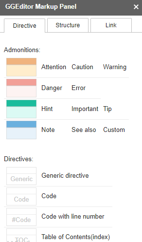
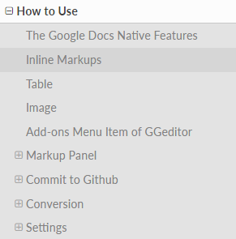

.. _h85b6993fe7e11412b481a47264959:

Come usarlo
***********

.. _h79285c4e7257194524363d5a1e617d44:

Per i principianti dei file RST
===============================

\ |STYLE0|\ 

|

.. _h665b13f663e6519330123b6940202c:

Il plug-in di Google Doc
========================

Per prima cosa si va su "Componenti aggiuntivi" e si scarica e si installa il plug-in su Google Doc \ |IMG1|\  

così si può cominciare ad usare il set di strumenti del menù che appare se clicchiamo su "componenti aggiuntivi", poi su "GGeditor" e poi ancora su "Show Markup Panel".

|

.. _h96481b373011705e781746f262f0:

Il Markup Panel
===============

Cliccando su su "Show Markup Panel" viene visualizzato questo pannello.\ |IMG2|\  

che ci consente di inserire sul documento in Google Doc:

* Note colorate, personalizzabili nel titolo;

* Codice da illustrare in una pagina HTML;

* Tabella dell'indice dei contenuti (cioè il titolo delle pagine che compongono l'indice dei contenuti).

|

.. _h20557f3997523b367c672f10583f2a:

Blocchi di codice
=================

|

.. _h577b282b652a133d475a216414d3a41:

senza righe numerate
--------------------

.. code:: 

    #!/usr/bin/env python
    
    """
    Twisted moved the C{twisted} hierarchy to the C{src} hierarchy, but C{git}
    doesn't know how to track moves of directories, only files.  Therefore any
    files added in branches after this move will be added into ./twisted/ and need
    to be moved over into
    """
    
    import os
    from twisted.python.filepath import FilePath
    
    here = FilePath(__file__).parent().parent()
    fromPath = here.child("twisted")
    toPath = here.child("src")
    
    for fn in fromPath.walk():
        if fn.isfile():
            os.system("git mv {it} src/{it}"
                      .format(it="/".join(fn.segmentsFrom(here))))
    
    os.system('git clean -fd')
    
    def outer(x):
    def indent_start(x):
        go start start
        go start end
    
    def end(y):
        go end start
        go end end

|

.. _h477f4023e6f37514b3e5a371a681858:

con righe numerate
------------------

.. code-block:: python
    :linenos:

    #!/usr/bin/env python
    
    """
    Twisted moved the C{twisted} hierarchy to the C{src} hierarchy, but C{git}
    doesn't know how to track moves of directories, only files.  Therefore any
    files added in branches after this move will be added into ./twisted/ and need
    to be moved over into
    """
    
    import os
    from twisted.python.filepath import FilePath
    
    here = FilePath(__file__).parent().parent()
    fromPath = here.child("twisted")
    toPath = here.child("src")
    
    for fn in fromPath.walk():
        if fn.isfile():
            os.system("git mv {it} src/{it}"
                      .format(it="/".join(fn.segmentsFrom(here))))
    
    os.system('git clean -fd')
    
    def outer(x):
    def indent_start(x):
        go start start
        go start end
    
    def end(y):
        go end start
        go end end

|

.. _h5d535b7f2e655f2e1f3e4c6225335713:

Note colorate di vario tipo
===========================

..  Attention:: 

    (content of Attention)

..  Caution:: 

    (content of Caution)

..  Warning:: 

    (content of Warning)

..  Danger:: 

    (content of Danger)

..  Error:: 

    (content of Error)

..  Hint:: 

    (content of Hint)

..  Important:: 

    (content of Important)

..  Tip:: 

    (content of Tip)

..  Note:: 

    (content of Note)

..  seealso:: 

    (content of See also)

.. admonition:: Change-me

    (content of Change-me)

--------

|REPLACE1|

|

.. _h496a7729534b3e4c36782439686453:

Altre (tante) funzioni di GGeditor
==================================

\ |IMG3|\ 

\ |LINK1|\  e \ |LINK2|\  sono descritte molte funzioni che possono essere attivate con GGeditor.

\ |LINK3|\  espone le funzioni abbastanza bene.

.. bottom of content

.. |STYLE0| replace:: *If you are a beginner of the reStructuredText and you feel a little bit of confusing about how to put your documents onto the RTD website. Now, with the GGeditor and this tutorial, I hope it can help you to get jobs done quicker and easier.*

.. |REPLACE1| raw:: html

    
    
    

    
    <noscript>Please enable JavaScript to view the <a href="https://disqus.com/?ref_noscript">comments powered by Disqus.</a></noscript>

.. |LINK1| raw:: html

    <a href="http://ggeditor.readthedocs.io/en/latest/User%20Guide.html" target="_blank">Qui</a>

.. |LINK2| raw:: html

    <a href="http://ggeditor.readthedocs.io/en/latest/Examples.html" target="_blank">qui (esempi)</a>

.. |LINK3| raw:: html

    <a href="http://ggeditor.readthedocs.io" target="_blank">Il tutorial di GGeditor</a>

.. |IMG1| image:: static/Tutorial_sull'uso_di_GGeditor_1.png
   :height: 109 px
   :width: 485 px

