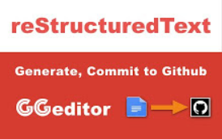

.. _h1173587464195a67462c6526383c69d:

Tutorial sull'uso di GGeditor
#############################

il tutorial è molto semplice nei passi da seguire, partendo innanzitutto da questo video:

|REPLACE1|

|

.. _h62049d30623c1a1c5869257e287c7b:

Come installare GGeditor
========================

\ |LINK1|\ , oppure in un documento Google:

#. Sul menu "componenti aggiuntivi" clicca “Installa componenti aggiuntivi”

#. Nel box di ricerca edita “GGeditor”, e clicca sull'icona di GGeditor per installare.

L'editor GG parte da uno scenario composto da 2 situazioni:

#. Tu già hai un repository di progetto su Github, 

#. Tu già hai un progetto su Readthedocs.or che è in diretta relazione al repository su Github.

Github e Readthedocs accettano formati RST o Markup. Hai bisogno di costruire la documentazione in uno di questi due formati. 

|

.. _h674712443519d775f679124c276a2c:

Il flusso di lavoro del processo che gestisce GGeditor
======================================================

Questo è il flusso di lavoro con GGeditor per costruire la documentazione su Github:

\ |IMG1|\ 

|

.. _h5f65204616512558169115d286b261d:

Le azioni svolte da GGeditor
============================

La sequenza di azioni che vengono effettuate da GGeditor su Google Doc nel processo che esso stesso gestisce. Ecco le fasi:

#. iniziare creando un nuovo documento su Google Docs.

#. Il nuovo file sarà nominato "Tutorial" (come nel caso di questa pagina che state leggendo). Il file contiene un'intestazione, un immagine e una nota creata dal sidebar di GGeditor.

#. Il nuovo file sarà compilato da GGeditor sul repository del progetto Github.

#. Siccome questo è un file nuovo, un processo sarà avviato per costruire il legame agli altri documenti (es. index) nel repository Github. Il processo avviato include: 

    #. log-in all'account Github che ospita il progetto su Github, 

    #. azioni di navigazione dentro Github, 

    #. creazione di un nuovo file 

    #. e l'attività di compilazione (commit di Github).

.. admonition:: Importante

    #. Quando nomini il tuo documento Google Doc, il nome del documento non necessita del suffisso "\ |STYLE0|\ ".
    
    #. Per legare il file del Google Doc sul repository del progetto (Github), Github  ha bisogno del suffisso ".rst". Il suffisso sarà automaticamente creato da GGeditor. Se nomini manualmente tu il file su Github allora aggiungi il suffisso "\ |STYLE1|\ " (sulla directory "docs" di Github).
    

|

.. admonition:: Importante

    il contenuto di questa pagina che state leggendo è in \ |LINK2|\ 

|

|REPLACE2|

.. bottom of content

.. |STYLE0| replace:: **.rst**

.. |STYLE1| replace:: **.rst**

.. |REPLACE1| raw:: html

    <iframe width="100%" height="380" src="https://www.youtube.com/embed/PUswAbvpE7c" frameborder="0" allow="autoplay; encrypted-media" allowfullscreen></iframe>
.. |REPLACE2| raw:: html

    
    
    

    
    <noscript>Please enable JavaScript to view the <a href="https://disqus.com/?ref_noscript">comments powered by Disqus.</a></noscript>

.. |LINK1| raw:: html

    <a href="https://chrome.google.com/webstore/detail/ggeditor/piedgdbcihbejidgkpabjhppneghbcnp" target="_blank">Clicca questo link per il plug-in da installare su Google Docs</a>

.. |LINK2| raw:: html

    <a href="https://docs.google.com/document/d/1H5CXu8rhCuryrG6NVjfgfk4csYezuw1dN4s0eg1tmhY/edit?usp=sharing" target="_blank">questo Google Doc</a>

